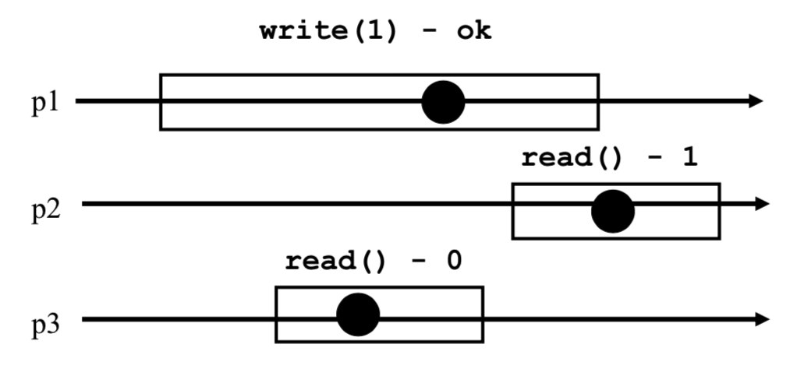
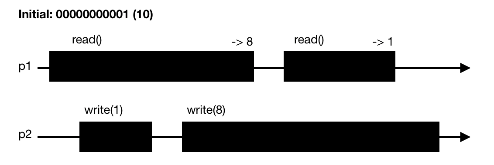
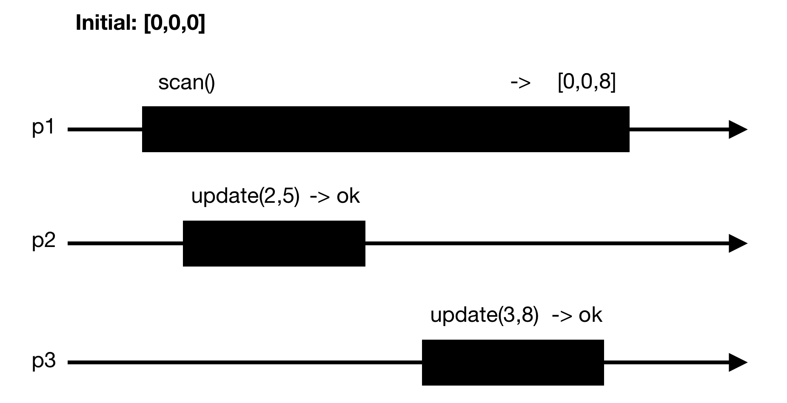

# Concurrent Algorithms
* These notes are based on the EPFL CS-453 Concurrent Algorithms course given in Autumn 2022 by Prof. Guerraoui.
* [Course Website](https://dcl.epfl.ch/site/education/ca_2021)
* The course follows the book [*Algorithms for Concurrent Systems*](https://www.epflpress.org/produit/909/9782889152834/algorithms-for-concurrent-systems) by Rachid Guerraoui, Petr Kuznetsov.

# Overview
1. Introduction
2. Implementing Registers  
    2.1. Assumptions & Vocabulary  
    2.2. Binary <ins>SRSW</ins> Safe -> Binary <ins>MRSW</ins> Safe  
    2.3. Binary MRSW <ins>Safe</ins> -> Binary MRSW <ins>Regular</ins>  
    2.4. <ins>Binary</ins> MRSW Regular -> <ins>M-Valued</ins> MRSW Regular  
    2.5. M-Valued SRSW <ins>Regular</ins> -> M-Valued SRSW <ins>Atomic</ins>  
    2.6. M-Valued <ins>SRSW</ins> Atomic -> M-Valued <ins>MRSW</ins> Atomic  
    2.7. M-Valued <ins>MRSW</ins> Atomic -> M-Valued <ins>MRMW</ins> Atomic
3. ...

# 1. Introduction  

With multicore architectures becoming the standard nowadays, we need a way to execute instructions concurrently following certain rules that make the programs execute in a coherent manner. We study here the foundations of the algorithms that enable such concurrency.

Here we assume multiple processes working on a shared memory space. The goal is to avoid any inconsistencies in the memory space while these processes execute concurrently, and for example we should be able to order the concurrent execution in a sequential manner such that the behavior of the concurrent execution is the same as that of a sequential one in terms of memory access and memory content (we call this **Linearizability**).

The most popular and easiest solution to such concurrency issues is the use of **locks**. They are objects that enable mutual exclusion of the shared memory meaning that at most 1 process can access a shared memory region at a time. The first process to acquire the lock to a certain shared region is the only one that can access this region, until this process releases the lock. In the meantime the other processes wanting to access the region wait. This can be extremely inefficient as a waiting process does not know when the lock is going to be released. Now there can be some logic put in place to mitigate this behavior, but this exposes a limitation one will have using locking in concurrent systems. Locking is efficient when concurrent processes access disjoint sets of memory, but this is often not the case in concurrent systems.  
The reason why locks are used as a first solution to concurrent execution is the following: they enforce a sequential execution of the concurrent set of instructions, thus memory manipulation is coherent. Locks synchronize the concurrent access and in fact provide an order on the instructions. But as we've discussed, this can penalize the execution time of the processes because they sometimes have to wait, and we can do better. The course thus aims at explaining how we do better. 

*TL;DR* - In this course we study how to **wait-free** implement high-level **atomic** objects out of basic objects.

* An operation (or object) is  **Atomic** if the operation (on the object) appears to execute at some indivisible point in time. 

* An operation (or object) is  **Wait-Free** if any correct process that invokes an operation (on the object) eventually (in french: "inévitablement") gets a reply.

* In the context of this course, we work with a finite set of n processes p_1, ..., p_n which are aware of eachother. Each process is sequential, and if a process crashes we assume that it does not recover. A process that does not crash is called *correct*.

* Most of the pseudocode that follows is written JAVA-like

Concurrent execution diagrams will be shown to represent situations. Here is an example below:  


* p1, p2, p3 represent processes. 
* The horizontal lines represent the execution timeline of each process. 
* Each box represents an operation currently executing. 
* Each dot represents an indivisible point in time where the operation could happen, these dots are used when we want to see if atomicity is possible in the execution diagram, this will be explained further later.

# 2. Implementing Registers

## 2.1 Assumptions & Vocabulary
A **register** is a memory space and has two operations: *read()* and *write()*.  
We call this a R/W register.  
We assume that we work only with  integers, since any object can be built on top of integers.  
Unless explicitly stated otherwise, registers are initially supposed to contain 0.  
The sequential specification of a register is as follows:  
```java
T x = 0; // The register

T read() {
    return x;
}

void write(T v) {
    x = v;
}
```
From these two basic sequential *read()* and *write()*, we will try to build up concurrent *read()* and *write()* operations for registers that support increasingly more robust concurrency specifications.  

These concurrency specifications come in 3 dimensions:  
* Dimension 1: value range
    * Binary (boolean, single bit)
    * Multivalued (multiple bits)
* Dimension 2: access pattern
    * SRSW (Single Reader, Single Writer)
    * MRSW (Multiple Reader, Single Writer)
    * MRMW (Multiple Reader, Multiple Writer)
* Dimension 3: concurrent behavior
    * Safe
    * Regular
    * Atomic

Elements in dimensions 1 and 2 are straight-forward to understand. Elements in dimension 3 need some definition, they represent correctness guarantees of the concurrent behavior of the register.  
* **Safe** register: This only ensures that a *read* that is not concurrent with any *write* returns the last value written.  
This means that when a *read* is concurrent with a *write*, the *read* may return any value in the set of possible values. Note that such registers do not support multiple writes, this would result in an undefied behavior and there could be any value in the register (to convince yourself, think of what would happen physically in the hardware with the signal).  

* **Regular** register: A *read* that overlaps with one or more *writes* can return the value written by any of these *writes*, as well as the value of the register before these *writes*.  
This means that while overlaping with a *write*, the *read* cannot return ANY value in the set of possible values, it has to return the MOST RECENT previously written value (or the value of the concurrent *write*), which is stronger than the safe register. Note again (for the same reason) that there cannot be multiple concurrent *writes*. But there can be multiple sequential (non-overlapping) *writes* that are concurrent with the *read*.  

* **Atomic** register: If two sequential *reads* happen concurrently with one or more *writes*, the value of the second *read* must be at least as recent as the value read by the first *read*.
This means that if the first *read* reads the value of a first *write*, then the second *read* cannot read the previous value of the register, it has to read the value of the first *write* (or, say, the value of a *write* that happens sequentially later than the first *write*). This is the key difference with the Regular guarantee, which we explain in more detail below.

The key difference between Regular and Atomic is what's called *new/old inversion*: in a Regular register, we could have the following situation: if two sequential *reads* are concurrent with a *write*, the first *read* could read the value of the *write* while the second *read* reads the previous value of the register. In an Atomic register, this is not permitted, because the previous value of the register is older than the value of the write.  
The diagram below shows an example of a valid execution for a regular register, but which is an invalid execution for an atomic register (don't pay attention to the dots).  


--

## 2.2 Binary SRSW Safe -> Binary MRSW Safe

Our basic sequential R/W register that we start from guarantees [Binary, SRSW, Safe].  
From there we will extend to obtain a R/W register that guarantees [Binary, MRSW, Safe], so we go from having a single reader to handling multiple concurrent readers.  

Our extension uses an array of SRSW registers `reg[]` of size N, where N is the number of processes. The *read()* and *write()* operations of our MRSW register are defined as follows:  
```java
boolean[] reg = new boolean[N]; // Each entry is Binary SRSW Safe

boolean read() { // Called by process i
    return reg[i].read();
}

void write(boolean v) {
    for(int i=0; i<N; ++i) {
        reg[i].write(v);
    }
}
```
Thanks to one array entry per process, no two processes acces the same SRSW register. When a *write* occurs concurrently with a *read*, either the previous value of the register is returned from the *read()* or the new value of the *write* is returned, which preserves Safety. So the [Binary, MRSW, Safe] guarantees are verified.  

Note that this transformation would also work if we go from [Multivalued, SRSW, Safe] to [Multivalued, MRSW, Safe], as well as from [Multivalued, SRSW, Regular] to [Multivalued, MRSW, Regular] (remember, we don't allow two *writes* to be concurrent).  
However, from [Multivalued, SRSW, Atomic] to [Multivalued, MRSW, Atomic] this transformation doesn't work. Think of a potential situation where it doesn't work (hint: first *read* 
with lower id than second *read*, concurrent with a *write*).

## 2.3 Binary MRSW Safe -> Binary MRSW Regular

Now we go from a register that provides [Binary, MRSW, Safe] guarantees to one that provides [Binary, MRSW, Regular] guarantees.  
To go from Safe to Regular, we need to restrict the number of possible outcomes of a *read()*, we can't have any value in the domain set. We will heavily rely on the fact that we have Binary.  
Since we work with binary, the domain set is {0, 1}, so if a *write* changes the value of the register then we can directly infer the previous value of the register since we only have two possible values, and Regularity is verified.   
Now this is when the *write* changes the value of the regiser. What about if the *write* writes the same value as the one currently in the register ? As our Safe register provides only safety, a concurrent *read* could read ANY value. In particular if the initial value is 0 and the *write* writes 0, the *read* could get 1 which violates Regularity since 1 was never a previous value in the register. Thus our transformation simply checks if the *write* will change the value or not. If it will, then we call the *write()* of our safe register, and we know that after this *write*, at some point our register will have contained 0 and 1.  
```java
boolean reg = 0; // Binary MRSW Safe

boolean read() {
    return reg.read();
}

void write(boolean v) {
    if(reg.read() != v) {
        reg.write(v);
    }
}
```

The transformation works also for SRSW.  
Since we rely on the fact that our domain set is of size 2 this doesn't work with Multivalued.  
It doesn't work for Regular to Atomic.

## 2.4 Binary MRSW Regular -> M-Valued MRSW Regular

Here we go from Binary to Multivalued MRSW Regular register.  

To do this we will use an array of [Binary, MRSW, Regular] registers and One-Hot encoding, with the interpretation that if the i'th binary value of the array is 1, then the value of the register is i. The size of the array is M+1 with M being the largest value in our domain set (for a JAVA integer, M would be `Integer.MAX_VALUE`).  

```java
boolean[] reg = new boolean[Integer.MAX_VALUE+1]; //[Binary, MRSW, Regular] registers

int read() {
    for(int j=0; j<Integer.MAX_VALUE; ++j) {
        if(reg[j].read() == 1) return j;
    }
}

void write(int v) {
    reg[v].write(1);
    for(int j=v-1; j>=0; --j) {
        reg[j].write(0);
    }
}

```
* The transformation would not work if the *write()* writes the 0s before the 1: consider the case where we have 01001 and no *writes* are currently running (it is a valid state and a *read()* would return 1). Now, a *write(2)* starts and a *read()* is concurrent with the *write*. Since we need to guarantee Regularity, the *read* should return 1 or 2. If we write the 0s before the 1 we could end-up in a situtation where the *write* removed the 1 (state 00001) and the *read* continues past the 1 and 2 to read the 4.  

* The transformation guarantees Regularity but not Atomicity: The following diagram shows an execution using the above *read()* and *write()* that violates Atomicity. The initial state of the register 10. The understanding is given as exercise.   


* The transformation guarantees wait-freedom: as we write 1 before writing 0s, any read would always necessarily come accross a 1. This explains why we don't need a default *return* in the above *read()* definition.

* Exercise: prove Safety using the definition of Safe register.

* Regularity is guaranteed: let v0 be the most recent value in the register. Now we have a *read* concurrent with a *write* with value v1. If v1 > v0, then either the *read* returns v1 or it returns v0. It cannot return v > v1 (v1 stops the *read*), it cannot return v < v0 because when v0 was written it cleared the smaller values, and it cannot return v0 < v < v1 because if v > v0 then v0 is 0 but then from the write definition all the v0 < v < v1 have also been cleared. The case v0 > v1 is similar, with the key point being that when writing we write 1 before clearing the smaller values. That way if the *read* happens all before the *write* then v0 will be returned, else v1 will be returned. This can be generalized to multiple *writes* concurrent with the *read*.

## 2.5 M-Valued SRSW Regular -> M-Valued SRSW Atomic

We come back to a Single Read register, to first try to go from Regular to Atomic.  

The goal here is that if we have two sequential *reads* with a concurrent *write* then the second *read* should return a value at least as new as the first *read*. In other words, we prevent new/old inversion. We achieve this using a timestamp. For 1 SRSW Atomic register we use 1 SRSW Regular register that stores both the timestamp and the value (one could think for example that the timestamp is stored in the MSBs and the value in the LSBs).   
We don't use 2 registers to prevent the timestamp from being inconsistent with the value (a *write* operation to these two memory places would need 2 steps and not 1, which could be concurrent with a *read*).  

```java
int reg = 0;
int [t, x] = 0;

int read() {
    int [t2, x2] = reg.read();
    if(t2 > t) {
        t = t2;
        x = x2;
    }
    return x;
}

void write(int v) {
    t = t+1;
    reg.write([t, v]);
}
```
* `reg` is the Single Read register
* `t` is the local variable representing the timestamp, the reader and the writer have one each.
* The notation `[t, x]` is used to represent a single variable containing two values as discussed above.
* For the `write()`, remember that we have Single Writer, so no concurrency can happen in it.

This would not work for multiple readers, as `reg` is SRSW so it doesn't support multiple readers reading into it.
If we were to extend the algorithm for multiple readers by setting `reg` to be an array of N SRSW registers (one entry for each reader), this would still not work. Whenever there is a *write*, it has to iterate over each entry of `reg` to update the value at each. At this moment, a reader can read the updated value of the *write* because the *write* had time to update its entry, while some time after, another reader reads the previous value before the write because the write didn't have time to update its entry. It is at this moment that there can be a new/old inversion.

An important note here is that we don't limit the size of the timestamp, in other words we assume we have infinite capacity. This algorithm only works if we assume this, and finding algorithms that work with limited capacity is still a hot topic in Concurrent Algorithms research.

## 2.6 M-Valued SRSW Atomic -> M-Valued MRSW Atomic

Since our algorithm in the previous section failed to guarantee atomicity when we have Multiple Readers, we now give an algorithm that succeeds.  

In the algorithm, we use a N*N matrix of SRSW Atomic registers to communicate among the readers (N is the number of readers). An entry (i, j) in the matrix corresponds to when reader i reads this entry and reader j writes to this entry (as we'll see a `read()` will write in the matrix to communicate to the other readers).  
We also use N SRSW Atomic registers to store new values. The single writer will only write in these N registers.

```java
int[][] rReg = new int[N][N]; //Initially all zeros
int[] wReg = new int[N]; //Initially all zeros
int t = 0; //Local variable (timestamp) only accessible from the single writer

int read() { //Called by reader i
    for(int j=0; j<N; ++j) { //Iterate over line i
        int [t_j, x_j] = rReg[i][j].read();
    }
    int [t_w, x_w] = wReg[i].read();
    int [t_m, x_m] = max([t_w, x_w], {[t_j, x_j] for j=0 to N-1}); //Max among all timestamps
    for(int j=0; j<N; ++j) { //Iterate over column i
        rReg[j][i].write([t_m, x_m]);
    }
    return [t_m, x_m];

}

void write(int v) {
    t = t+1;
    for(int i=0; i<N; ++i) {
        wReg[i].write([v, t]);
    }
}
```
The main issue with our algorithm in the previous section for multiple readers is that, while the writer writes into the memory places of every readers (here it's identified as `wReg`), one first reader can read the updated value from this writer and then finish, and a next reader can read the previous value because the writer hasn't had the time to iterate over its memory place yet. This creates a new/old inversion because the first reader finished reading before the second reader started.  
In our new algorithm here, this cannot happen, because the first reader communicates the value it has decided to read to all the other readers (this is done when the reader writes) before finishing. That way the next reader will read the value written by the previous reader (first step of the `read()`) and it knows it has to return a value at least as recent as this one. Note: we know that the previous reader has returned when the next reader starts.  
This can (to some extent) be thought of as a consensus mechanism put in place among the readers, where they agree on the latest value read by any of them.

The algorithm doesn't work for multiple writers, because each entry of `wReg` only supports Single Writer.

## 2.7 M-Valued MRSW Atomic -> M-Valued MRMW Atomic

To create an algorithm that enables 1 register to support Multiple Writers (N of them), we'll use N registers that support MRSW. Register j is for writer j.  

```java
int[] reg = new int[N]; //N MRSW Atomic registers

int extract_max() {
    for(int j=0; j<N; ++j) {
        [t_j, x_j] = reg[j].read();
    }
    [t_m, x_m] = max({[t_j, x_j] for j=0 to N-1}) //Max among timestamps
    return [t_m, x_m];
}

int read() {
    [t_m, x_m] = extract_max();
    return x_m;
}

void write(int v) {
    [t_m, x_m] = extract_max();
    t_m = t_m + 1
    reg[i].write([t_m, v]);
}
```

Any writer w2 that writes after the most recent finished writer w1 will have at least w1's timestamp, so its new timestamp will be up to date.  
Any read r2 that reads after the most recent finished read r1 (who read t1 as latest timestamp) will read at least t1 as latest timestamp, so r2 is guaranteed to return a value at least as recent as r1, which verifies Atomicity.

# 3. The Power of Registers

What atomic objects can we implement in a wait-free manner with registers ?  
Here, we present two common (and interesting) objects that can be implemented in such a way.  

## 3.1 Counter

A counter can be read and incremented, its sequential specification is as follows:

```java
T x = 0;

T read() {
    return x;
}

void inc() {
    x = x + 1;
}
```
We now implement the counter in a concurrent context such that every operations appear to execute sequentially, without using locks. 
* We use our atomic registers implemented in the previous sections. 
* The N processes share an array of registers of size N, where register i is only modified by process i.

The idea is very simple and elegant, and it simply relies on the fact that each process increments its own counter, and when there is a read, the read will sum on all the counters.

```java
T[] reg = new T[N];

void inc() { // Called by process i
    reg[i].write(reg[i].read()+1)
}

T read() {
    T sum = 0;
    for(int i=0; i<N; ++i) {
        sum = sum + reg[i].read();
    }
    return sum;
}
```
* This implementation is wait-free, because the `read()` and `write()` operations of `reg` are wait-free, and in the read we iterate a finite number of times.
* This implementation is atomic, because the increments are isolated between processes, and the `read()` operation of the registers is atomic (thus a newer sum will always be at least as high as an older sum).


## 3.2 Snapshot

This object is more complicated to implement than the counter. A snapshot maintains an array of size N (the number of processes). Its sequential specification is as follows:

```java
T[] x = new T[N];

T[] scan() {
    return x;
}

void update(int i, T v) {
    x[i] = v;
}
```
So it's like a mutable array, but it can only be read/returned entirely. It is powerful that we can implement this object while supporting our concurrency specifications.  

Let's first look at a naive concurrent implementation that doesn't work. The `scan()` basically copies the array entry by entry, and the `update(i,v)` atomically updates entry i associated to process pi with value v (possible because register i is atomic). Consider that `update(i,v)` is always called by process pi, and a write to `reg[i]` is only done by pi. 

```java
T[] reg = new T[N];

T[] scan() {
    T[] x;
    for(int i=0; i<N; ++i) {
        x[i] = reg[i].read();
    }
    return x;
}

void update(int i, T v) { // If index is i, then called by process pi
    reg[i].write(v);
}
```

With this implementation the following scenario is possible:  



Atomicity is violated because we cannot linearize the execution, i.e. we cannot put a dot in the scan of p1, put a dot in the update of p2 and put a dot in the update of p3 and have the output we got. To get atomicity, we need [update of p3 read => update of p2 read].

The fact that this implementation doesn't work really shows (or defines) what our atomicity goal is. We don't just want atomicity per entry of the array. We want atomicity on the whole array. Even though `update(i,v)` acts on a single entry, its behavior must be as if it acted on the whole array (on every entries) at once.  

Now, we try to get atomicity.  
Observe that, using scan from the previous naive implementation, if we execute scan once and then we execute scan a second time and the values didn't change, then we've found an indivisible point in time where no writes happended during the time we read, i.e. we've found a linearization point. This point is between the two scans. This is a key idea to reach atomicity.  
Actually, there's a small error in what we've just said. Scanning twice and checking if no values changed doesn't mean writes didn't happen. There could have been a write that changed the value and then another write that changed back to the previous value. To really capture the fact that no writes occured, we use timestamps. Now if we check if no timestamps changed, then we have our linearization point.

```java
T[] reg = new T[N];
int ts = 0;

T[] collect() {
    T[] x;
    for(int i=0; i<N; ++i) {
        x[i] = reg[i].read();
    }
    return x;
}

T[] scan() {
    T[] t1 = collect();
    T[] t2 = collect();
    while(t1 != t2) {
        t1 = t2;
        t2 = collect();
    }
    return t1;
}

void update(int i, T v) { // If index is i, then called by process pi
    ts = ts + 1;
    reg[i].write(ts, v);
}
```
* Each entry in `reg` is of the form `[t,v]` where t is a timestamp and v is a value.
* `ts` is a local variable for each process, and `reg` is shared among processes.
* `t1 != t2` means there exists an entry i such that t1[i] != t2[i].
* `collect()` is the function that reads through and copies the entire array.  

This algorithm guarantees atomicity, but what about wait-freedom ? A process could get indefinitely stuck in `scan()` because other processes keep updating values. We have to modify the algorithm to account for this.  

To do this, the faster processes that keep updating will themselves try to `scan()`. Only if they succeed on scanning will they be able to update, and when they update they also write the scan they got to share it to other processes.  
So now each entry of the array will contain 3 elements: a timestamp, a value, and a copy of the entire array of values (to share to other processes as potential scans to use).  

To `scan()`, a process keeps collecting until two successive collects do not change, or some collect returned by another concurrent scan is valid (validity will be made clear in the algorithm pseudocode).  
To `update()`, a process scans, and then writes the value, the new timestamp, and the result of the scan.

```java
T[] reg = new T[N];
int ts = 0;

void update(int i, T v) { // If index is i, then called by process pi
    ts = ts + 1;
    T[] s = scan();
    reg[i].write(ts, v, s);
}

T[] collect() {
    T[] x;
    for(int i=0; i<N; ++i) {
        x[i] = reg[i].read();
    }
    return x;
}

T[] scan() {
    T[] t1 = collect();
    T[] t2 = t1;
    while(true) {
        T[] t3 = collect();
        if(t3 == t2) return values(t3); // Return 2nd element of each cell of t3
        for(int i=0; i<N; ++i) {
            if(t3[i][1] >= t1[i][1]+2) return t3[i][3]
        }
        t2 = t3;
    }
}
```
* Each entry in `reg` is of the form `[t,v,s]` where t is a timestamp, v is a value and s is a copy of the values of the array.
* `ts` is a local variable for each process, and `reg` is shared among processes.
* `t1 != t2` means there exists an entry i such that t1[i] != t2[i].
* `collect()` is the function that reads through and copies the entire array.  

The last thing to clarify is the `+2`. +1 would make sense, because we would take the scan of the process that made the update in-between our two collects. Call this process p. But +1 is a problem when p made its scan long before it actually updates and writes in the register. Between its scan and the time it actually updates (thus when a collect will capture the update), there could be a situation where another process updates, and p's scan didn't capture that update. This case is subtle but it would violate atomicity, and thus +2 is here to ensure this situation doesn't happen, and p's scan indeed captured all the necessary updates until itself.

The 3 key points of this algorithm are:
* The use of timestamps
* `collect`ing twice and checking if nothing changed to get a linearization point
* Sharing the scan of fast processes to prevent blocking of other slower processes

*Note that here we have restricted that the array of Snapshot was the same size as the number of processes, and entry i is associated to process pi meaning only pi can write at entry i. In the [Anonymous Concurrent Computing](#8-anonymous-concurrent-computing) section we talk about a [general Snapshot](#82-general-snapshot) object, where the array is of any size, and any process can update any entry.*

# 4. The Limitations of Registers

What objects cannot be implemented with registers if we want them to be atomic and wait-free ?  
In this section we look at the impossibility of consensus theorem, and we use this theorem to prove that some objects cannot be implemented using only registers in a concurrent context.  

## 4.1 Impossibility of Consensus

Consensus is an object that has only one function `propose(v)` which returns a value. When a value is returned we say that this value was decided. `propose` is called by each process and the specifications of consensus are as follows:
* (wait-freedom/termination) when `propose` is called, it eventually returns
* (agreement) no two processes decide differently
* (validity) any decided value has been proposed

<ins>**Theorem:**</ins> No asynchronous deterministic algorithm implements consensus among two processes using only registers.  

Asyncronous means there are no time bounds on the execution of concurrent processes.

<ins>*Proof:*</ins>  
We proceed by contradiction and assume such an algorithm A exists. Consider p0 and p1 two processes, and registers r1,...,rK.  

We first state some elements of the model
* An operation on a register can only be either a read or a write.
* A *configuration* C is a global state of the concurrent system. A state is composed of the values of p0 and p1 (at initial, the values are what they propose, and when returning, the values are what they decide), and the values of the registers.
* A *step* enables to transition from a configuration to another, it consists in reading or writing a value in a register and changing p0 or p1's state according to algorithm A. A step is executed by one process, and the configuration resulting from taking a step with process pi from C is noted as pi(C).
* A *schedule* S is a sequence of steps. S(C) denotes the configuration that results from applying the sequence of steps S to configuration C.
* An adversary decides which process executes the next step and the algorithm A deterministically decides the next configuration based on the current one. 
* Let u be 0 or 1. A configuration C is *u-valent* if, starting from C, no matter what schedule we take, no decision other than u is possible. In that case C is *univalent*.
* If starting from C, both 0 and 1 can still be decided depending on the schedule (i.e. depending on the adversary), then C is called *bivalent*.
* We will write C = C' when C and C' have the same "valence" (either bivalent, 0-valent, or 1-valent).

The proof is based on the following two lemmas:
* <ins>Lemma 1:</ins> There is at least one initial bivalent configuration.

* <ins> Lemma 2:</ins> Given a bivalent configuration C, there is an arbitrary long schedule S such that S(C) is bivalent.

So what this means is, the adversary can always start at an initial bivalent configuration, and indefinitely transition from a bivalent configuration to another bivalent configuration. Thus the algorithm never makes a decision because it never gets to a univalent configuration, and it violates wait-freedom. We indeed have our contradiction, which concludes the proof.  

We now (informally) prove the lemmas, which give good intuition as to why consensus is not possible using only registers.

* Lemma 1: the initial configuration C(0,1) is bivalent. C(0, 1) means that p0 proposes 0 and p1 proposes 1.  
We show that the decision is dependent on the adverary's schedule, meaning that with adversary's schedule S, 0 could be decided, and with adversary's schedule S', 1 could be decided. Let's say that for S the adversary kills p1. Then p0 cannot know what p1 proposed and sees that p1 was killed. By the validity property of consensus, p0 will decide 0. Let's say now for S' that the adversary kills p0. Same story here, p1 will decide 1. Thus with this initial configuration 0 or 1 could still be decided and so it is not univalent.  
*(On the other hand, convince yourself that C(0,0) is univalent)*

* Lemma 2: we have C is bivalent. Let's say towards contradiction that there are no *arbitrary long* schedule S such that S(C) is bivalent. Then, there is a schedule S with maximum length such that D=S(C) is bivalent, and any S'(D) is univalent.  
Let's see what can happen after D.
    1. Either p0 executes a step and p0(D) is 0-valent, or p1 executes a step and p1(D) is 1-valent (the case [p0, 1-valent] and [p1, 0-valent] is similar). It cannot be that p0(D) is u-valent p1(D) is also u-valent because otherwise it would mean that D is u-valent (thus univalent).    
    1. We claim that from D, when p0 executes a step and p1 executes a step, they both access the same register. If they don't, then we would have p0(p1(D)) = p1(p0(D)) because they work on different parts of memory. But this is impossible because we said that p0(D) is 0-valent and p1(D) is 1-valent, meaning that p1(p0(D)) would be 0-valent and p0(p1(D)) would be 1-valent because decision is made when having univalence. So p0 and p1 access the same register, and the order of execution (either p0 first or p1 first) is critical.  
    1. Now, we claim that the step of p0 or p1 cannot be a read. If it is a read, then, since a read doesn't modify the register values, it doesn't change the configuration, and p0(D) = D or p1(D) = D, which contradicts what we said D was (D is the "last" bivalent configuration). So p0 and p1 can only do a write.  
    1. Finally, we claim that the step of p0 and p1 cannot be a write either. If they write, then, since p0 and p1 work on the same register, depending on the order of the write and using the fact that our register is wait-free and atomic, p0 and p1 will overwrite each other. Thus p0(p1(D)) = p0(D), and p1(p0(D)) = p1(D). Since p1(D) is 1-valent, p0(p1(D)) should be 1-valent, but p0(D) is 0-valent => contradiction. The other case is similar.  
    5. Since we can only read or write on a register, we cannot "move from D" and reach univalance. This means that our algorithm A would never decide, which is a contradiction. This concludes the proof of lemma 2.

This shows that the register object is too weak for consensus, read and write is not enought. In some sense we would need something more than just read and write to be able to implement consensus.  

In what follows, we present some objects that cannot be implemented in our concurrent context using only registers.   
The way we prove that they cannot be implemented using only registers is by proving that we can implement consensus using these objects. This makes sense, because if we can implement consensus using these objects and consensus cannot be implemented using only registers, then these objects cannot be implemented using only registers.

## 4.2 Fetch&Inc

The Fetch & Increment object is a counter that contains an integer. It has one operation, `fetch&inc()`, which increments the counter by 1 and returns the new value of the counter. 
Its sequential specification is as follows

```java
int c = 0;

int fetch&inc() {
    c = c + 1;
    return c;
}
```
We now present an algorithm for Consensus that uses two registers r0 and r1, and a Fetch&Inc object C.  
`propose` is called by each process (p0 and p1), and pi writes in register ri.

```java
FetchInc c = new FetchInc();
int r0 = 0;
int r1 = 0;

int propose(int v) { // Called by process pi
    if(pi == p0) r0.write(v);
    if(pi == p1) r1.write(v);
    int val = c.fetch&inc();
    if(val == 1) return v;
    else {
        if(pi == p0) return r1.read();
        if(pi == p1) return r0.read();
    }
}
```

Since Consensus cannot be implemented using only registers, and by the fact that we've built an algorithm that implements Consensus using only registers and Fetch&Inc, we have that Fetch&Inc cannot be implemented using only registers.

## 4.3 Queue

The Queue is an object containter with two operations: `enq(v)` and `deq()`. It is a FIFO data structure that you can learn about on internet. Can we implement an atomic wait-free Queue using only registers ? No, because we can implement Consensus using a Queue and registers.  
The algorithm is as follows: it uses two regisers r0 and r1, and a Queue q initialized to {"winner", "loser"}.

```java
Queue<String> q = new Queue({"winner", "loser"});
int r0 = 0;
int r1 = 0;

int propose(int v) { // Called by process pi
    if(pi == p0) r0.write(v);
    if(pi == p1) r1.write(v);
    String item = q.deq();
    if(item == "winner") return v;
    else {
        if(pi == p0) return r1.read();
        if(pi == p1) return r0.read();
    }
}
```

## 4.4 Test&Set

A Test & Set object maintains a binary value x initialized to 0. It provides one operation `test&set()`, which basically sets x to 1, and returns the previous value of x. Once x is set to 1, the operation doesn't have anymore impact. This object is useful for example when processes race. x can be viewed as a key, and once it is taken, it is taken forever.  
The sequential specification is as follows:

```java
boolean x = 0;

boolean test&set() {
    boolean y = x;
    x = 1;
    return y;
}
```

Test&Set cannot be implemented in an atomic and wait-free manner using only registers, because we can implement Consenus using Test&Set and registers.  
The algorithm is as follows: it uses registers r0 and r1, and a Test&Set object t.

```java
TestSet t = new TestSet();
int r0 = 0;
int r1 = 0;

int propose(int v) { // Called by process pi
    if(pi == p0) r0.write(v);
    if(pi == p1) r1.write(v);
    int val = t.test&set();
    if(val == 0) return v;
    else {
        if(pi == p0) return r1.read();
        if(pi == p1) return r0.read();
    }
}
```

## 4.5 Compare&Swap

The Compare & Swap object maintains a value x, initialized to `null`. It provides one operation `compare&swap(old,new)`. The operation compares x with `old`, and if they are equal assigns value `new` to x. If they are not equal the operation doesn't do anything. The operation returns the new value if x and `old` we equal, and it returns x otherwise.  
The sequential specification is as follows:

```java
T x = null;

T compare&swap(T old_v, T new_v) {
    if(x == old_v) x = new_v;
    return x;
}
```

Compare&Swap cannot be implemented in an atomic and wait-free manner using only registers, because we can implement Consenus using Compare&Swap and registers.  
The algorithm is as follows: it uses a Compare&Swap object c.

```java
CompareSwap c = new CompareSwap();

int propose(int v) { // Called by pi
    Integer val = c.compare&swap(null, v);
    if(val == v) return v;
    else return val;
}
```

# 5. Universal Construction

We've seen in the previous section that we can't implement any object in our concurrent context using only registers. Is there a stronger object that can be used to implement any object in our concurrent context ?
This first requires to define what object we're looking for.

<u>*Universality:*</u> An object T is *universal* if, together with registers, instances of T can be used to provide a wait-free linearizable implementation of any other object T'.  

In the previous section we proved that in our concurrent context Consensus is impossible to implement using only registers. But we can ask ourselves, if we are able to implement Consensus, would there still be any object that would be impossible to implement in our concurrent context ? The answer is in fact no. Consensus is the strongest possible object in our concurrent context, and so Consensus is universal.  
In this section, we demonstrate the power of Consensus in implementing any wait-free atomic object. To this end, we implement an algorithm that builds any wait-free atomic object T', using only registers and instances of Consensus. 

*Before we continue, note that since Consensus is universal, then every objects that we presented in the previous section (Fetch&Inc, Compare&Swap, ...) are universal.*  

## 5.1 Deterministic case

To simplify the explanations and the algorithm, we first concentrate only on **deterministic** objects. We will see later how we can modify the algorithm presented to make it work for general (deterministic and non-deterministic) objects.  

First we list the building blocks of the algorithm.  
* The object we want to implement using the algorithm is T'. For example, think of it as a Queue.
* The operations used in the algorithm are `read()`, `write()`, and `propose()`.
* Each process has its own copy of T'. Think of this as each process has its own instance, but instances communicate with eachother.
* Instances communicate with eachother through registers and consensus objects.
* Processes share an array of N MRSW registers called `REQ` (N being the number of processes). 
* Processes share an array of Consensus instances `CONS` (of possibly infinite size, actually the size of the number of total requests made to the object at the end of execution).
* Each process has its own local data structures: a list `PERF` storing requests that the process has performed, and a list `INV` of requests that the process still needs to perform. We explain what this is later.
* Note that every requests are uniquely identified

Now, the algorithm goes as follows.
* `REQ` is used to inform all processes about which requests need to be performed. Whenever pi has a new request (via a function of T'), pi adds the request to `REQ[i]`. The other processes will be able to see that request, and will perform it as well on their side (on their local copies of T'). This will help linearize all the different requests different processes get. 
* To ensure linearizability of the requests, every process must perform the requests in the same order. This is where `CONS` comes into play. It enables every processes to treat the requests in the same order. Each time they must treat a request, they go into a new round r, and they decide which request is treated at round r with `CONS[r]`.
* Note that pi waits for `REQ[i]` to be performed before treating a new request coming at it. That way request in `REQ[i]` is not overwritten until it was performed. The algorithm is still wait-free because `REQ[i]` is eventually performed so the next request is eventually treated.
* Thus, `REQ` and `CONS` are combined to ensure that 1. every request invoked is performed and a result is eventually returned 2. requests are executed in the same total order at all processes (linearization) 3. this order 
preserves the real-time order of requests that are made to the same process. For example, for the Queue, the order will decide which [`enq(5)` from p0] or [`enq(8)` from p1] goes first, but both will be done by p0 and p1 on their local copy of the Queue.
* Periodically, pi goes through `REQ` and for all j in [N], appends `REQ[j]` at the end of `INV` if it is not in `PERF`. `INV` is the (ordered) list of pending requests made to all processes, it should not contain a request that has already been performed.
* If `INV` is not empty and we are at round r, pi proposes `INV[0]` to `CONS[r]`. Once `CONS[r]` returns with request v, r is incremented, pi adds v to `PERF`, removes v from `INV`, and performs v. If v = `REQ[i]`, pi returns the result of performing v, and `REQ[i]` can be overwritten.
* The algorithm can be modified so that Consensus works with an ordered list of requests instead of a single request. For example, when requests are made to pi, they are added (in order) into `REQ[i]` which is now a list, and then this list is added into `INV`. This removes the need to wait for `REQ[i]` to be performed to prevent from overwritting it.

The two key points of the algorithm are 
1. every process performs locally every requests made, no matter from which process the request came from in the beginning (job done with registers).
2. all of the requests are ordered and this order is the same for every processes (job done with Consensus).  

*You should convince yourself of the correctness of the algorithm. [wait-freedom], [linearizability/total-order], [valid per-process order] need to be proved.*

Note that this algorithm only works for deterministic objects.  
An object is deterministic if, for any request R there exists a single response S associated with that request. For non-deterministic objects, for a request R there exists a set of possible responses {S1, S2, ...} for R. A good example of deterministic object vs non-deterministic object is list vs set: a list guarantees an ordering of elements according to the time elements were added, whereas a set doesn't guarantee any order.  
One can see that the algorithm doesn't work if we consider T' to be a set. If T' is a set, then removing at a certain index in the set might behave differently from process to process because there is no defined order.  
  
## 5.2 General (Deterministic and Non-Deterministic) Case

There exist adaptations to our algorithm so that it still works for non-deterministic objects.  
One adaptation is to "restrict" the non-deterministic object to a deterministic one, i.e. we add a constraint (an ordering) in our algorithm such that for a request R, instead of having the processes give potential different responses from the set {S1, S2, ...}, they give the same response according to the constraint (the ordering), say S1. This is a valid restriction because the response given by the processes is a valid response, i.e. it still comes from the set of possible responses {S1, S2, ...} for the given request R. For example, in the case of the set, the constraint could be to add an ordering of the elements in the set, so that the set behaves as a list when accessing elements in it.  
Another different adaptation is to modify what we propose to a Consensus instance. Instead of just proposing the request, pi first performs the request and then proposes the pair (request, response). That way processes agree on request R, and uppon request R, they also agree on which response to return from the set {S1, S2, ...}. 

We've just implemented an algorithm that implements any wait-free atomic object T' using only registers and Consensus :)

# 6. Implementing the Consensus Object with Timing Assumptions

We've seen that Consensus, in a completely asynchronous setting, is impossible to implement. But in practice, it is reasonable to assume some timing assumptions that are true at some point. In practice, concurrent systems are usually synchronous, and only sometimes asynchronous.  
In this section, we implement a weaker version of Consensus, in that it assumes a timing assumption on our system.  

The way we proceed is we divide Consensus into modular parts:
1. We implement *Wait-free Consensus (Consensus)* through *Lock-free Consensus (L-Consensus)* and *Registers*.
1. We implement *L-Consensus* through *Obstruction-free Consensus (O-Consensus)* and *Enventual Leader Election (<>Leader)*.  

<u>**Consensus:**</u>
* **Wait-free termination**: If a correct process proposes, then it eventually decides (every process progresses)
* Agreement: No two processes decide differently
* Validity: Any value decided must have been proposed

<u>**L-Consensus:**</u>
* **Lock-free termination**: If a correct process proposes, then *at least one* correct process eventually decides (there is some progression in the system)
* Agreement: same as Consensus agreement
* Validity: same as Consensus validity

<u>**O-Consensus:**</u>
* **Obstruction-free termination**: If a correct process proposes and *eventually executes alone*, then the process eventually decides
* Agreement: same as Consensus agreement
* Validity: same as Consensus validity

<u>**<>Leader:**</u>
* Completeness: If a correct process invokes `leader()`, then the invocation returns and *eventually*, some correct process is *permanently* the only leader

## 6.1 O-Consensus

Now we start by implementing O-Consensus. We want to make sure that a process that is eventually "left alone" to execute steps, eventually decides. Of course we also want agreement and validity to hold. The building blocks of the algorithm are:
* Assume N processes
* Each process pi maintains a local timestamp `ts`, initialized to i and incremented by N
* Processes share an array of MRSW atomic register pairs `Reg` of size N. Element i of the array contains `Reg[i].T`, a timestamp initialized to 0, and `Reg[i].V`, a pair (value,timestamp) initialized to (null, 0). Assume that we work with values of type P.
* Intuitively, processes will execute multiple rounds and they will use these registers to communicate with each other and preserve validity and agreement. On top of that, if a process executes alone, it will be able to decide v, and later the other processes will agree on v.  

To simplify, we assume the following two functions applied to `Reg`:
```java
/* Returns the highest timestamp among all elements of Reg[1,..,N].T */
int highestTsp() {
    return max{Reg[i].T for(i=0; i<N; ++i)};
}

/* Returns the value with the highest timestamp among all elements of Reg[1,..,N].V */
P highestTspValue() {
    int j = argmax{Reg[i].V.timestamp for(i=0; i<N; ++i)};
    return Reg[j].V.value;
}
```
Here is the algorithm:

```java
// Point of view of process pi
int ts = i;

P propose(P v) {
    while(true) {
        Reg[i].T.write(ts);                 (1)
        P val = Reg.highestTspValue();      (2)
        if(val == null)
            val = v;
        Reg[i].V.write(val, ts);            (3)
        if(ts == Reg.highestTsp())          (4)
            return val;
        ts = ts + N;
    }
}
```
* (1): pi announces its timestamp
* (2): pi selects the value with the highest timestamp (or its own if there is none)
* (3): pi announces the value it selected with its timestamp
* (4): if pi's timestamp is the highest (meaning no other process entered (1) after pi), then pi can decide (pi knows that once it decided, any process that executes (2) will select pi's selected value).

## 6.2 L-Consensus

In this part, we implement L-Consensus using <>Leader and O-Consensus. <>Leader is the subject of the next subsection.  
The idea is to use <>Leader to make sure that, eventually, one process keeps executing steps alone, until it decides. The difference with O-Consensus is that in O-Consensus we assume this will arrive eventually, whereas in L-Consensus we have no guarantees that it will arrive, so we force it.

Assume for now that <>Leader is provided and is a black box. The operation it provieds is `leader()` which returns a boolean. A process considers itself leader if the boolean is true. <>Leader verifies its property defined in the begining of the section.  

The algorithm proceeds similarly as in algorithm for O-Consensus. It uses the same building blocks, and the only difference is that `leader()` is used to make sure that eventually the code block inside the while loop is executed by a single process: the leader.

```java
// Point of view of process pi
int ts = i;

P propose(P v) {
    while(true) {
        if(leader()) {                      (*)
            Reg[i].T.write(ts);                 
            P val = Reg.highestTspValue();      
            if(val == null)
                val = v;
            Reg[i].V.write(val, ts);            
            if(ts == Reg.highestTsp())          
                return val;
            ts = ts + N;
        }
    }
}
```
The only change from O-Consensus algorithm is (*).  

## 6.3 Consensus

Assuming we have the <>Leader object, the algorithm for L-Consensus makes sure that eventually at least one process decides. To get Consensus, we want that all processes eventually decides. So to implement Consensus from L-Consensus, we can add a shared register R, that is used to display the decided value once a process decides from L-Consensus.  
Let p be a process that eventually decides from L-Consensus. p exists because at least one process eventually decides. Let R be the shared register, initialy containing null. Once p has decided v, p writes v into R. Periodically, every processes read R. If the value read is not null, then they can decide this value.  

```java
// Point of view of process pi
int ts = i;

P propose(P v) {
    while(R.read() == null) {               (*)
        if(leader()) {                      
            Reg[i].T.write(ts);                 
            P val = Reg.highestTspValue();      
            if(val == null)
                val = v;
            Reg[i].V.write(val, ts);            
            if(ts == Reg.highestTsp())          
                return val;
            ts = ts + N;
        }
    }
    return R.read();                        (**)
}
```
The only changes from L-Consensus algorithm are (*) and (**).

This enforces the constraint that, once a process has decided, eventually, all the other correct processes decide. Since by L-Consensus there is eventually one process that decides, then eventually every correct process decides.


## 6.4 <>Leader

Finally, it remains to implement <>Leader. We state again its property:
* Completeness: If a correct process invokes `leader()`, then the invocation returns and *eventually*, some correct process is *permanently* the only leader

Note that we didn't yet use our timing assumption.  
As stated in L-Consensus part, the operation it provides is `leader()` which returns a boolean. A process considers itself leader if the boolean is true. Note that `leader()` can return true for multiple processes, the only guarantee is that eventually it returns true for a single process. This is where our timing assumption comes into play. 

We assume that the system is eventually synchronous:
* There is a time after which there is a lower and an upper bound on the delay for a process to execute a local action, a read, or a write in shared memory.
* The time after which the system becomes synchronous is called the global stabilitzation time (GST). It is unknown to the processes.

Let's look at the building blocks for the algorithm of <>Leader:
* General rule: each process pi elects (locally) the process with the lowest identity that pi considers as non-crashed. So if pi elects pj, then j <= i.
* `REG` is an array of MRSW registers of size N (the number of processes), all initialized to 0. If pi considers itself to be the leader, then pi will periodically increment `REG[i]`. This helps indicate to each pj with j >= i that pi is non-crashed and ready to be the leader. Eventually, only the unique leader keeps incrementing its `REG[i]`.
* Each pi has local variables `clock`, `check`, and `delay`. `clock` is used to help pi measure time (initialized to 0), `check` is the time at which pi might revise its jugement about who is the leader (initialized to 1), and `delay` is the delay between each time pi decides to revise its jugement (initialized to 1). They are all linked, this will be made clear when reading the algorithm.
* Each pi also has a local array `last` of size N (all initialized to 0), to record the last values of `REG` pi read. If `REG[j]-last[j]>0`, then pi knows pj is non-crashed and is ready to be the leader.
* The next leader pi chooses is the one with the smallest process id (less than i) that is non-crashed and ready to be the leader, or itself if no id smaller than i is ready.

We present the algorithm as being an object that has its own thread once created.
```java
// Code executed by pi

int self;
int leader = 1;
int check = 1;
int delay = 1;
int[] last = new int[N];

boolean leader() {
    return leader == self;
}

Leader(int i) { // Called by pi
    self = i;
    int clock = 0;
    while(true) {
        if(leader == self)
            REG[i].write(REG[i].read()+1);
        clock = clock + 1;
        if(clock == check)
            elect();
    }
}

void elect() {
    boolean foundLeader = false;
    int j = 0;
    while(!foundLeader && j<self) {
        if(REG[j].read() - last[j] > 0) {
            foundLeader = true;
            last[j] = REG[j].read();
            if(leader != j)                 (*)
                delay = delay*2;
            leader = j;
        }
        ++j;
    }
    check = check + delay;
    if(!foundLeader)
        leader = self;
}
```
* The first thing to understand is that pi will call `elect()` every `delay` time. During this delay, another process pj can have the time to increment its `REG[j]` if it thinks it can be leader and it is non-crashed. But pj might be too slow to increment relative to pi's `delay`. So later, when pi realizes this (with (*)), it will lengthen its `delay` value, giving eventually enough time for pj to increment. 
* Since our time assumption says that eventually we have a bound on the time pj takes to do an operation, pi's `delay` will eventually grow until being larger than this bound, and pi will eventually always detect the increment in `REG[j]`.
* So eventually, pi detects every increment `REG[j]` such that pj thinks it can be leader and it is non-crashed. More generally, every processes eventually detect any increments in `REG`. Since they will choose the smallest j such that pj made an increment, they will eventually choose the same leader. This leader will permanently be the only leader.
* Last observation: `clock` is the time relative to how fast pi executes instructions, so when the algorithm converges to a single leader, processes might get different values of `delay`.

# 7. Transactional memory

Transactions are a sequence of operations that we want to execute as if they were a single atomic operation. We roughly want 

```java
atomic {
    operation 1;
    operation 2;
    ...
}
```

Transactional memory has been a very hot topic in concurrent systems, and it is used in critical parts of some of the most common systems used in industry, for example database systems.  
The properties of transactional memory are:  
* Snapshot isolation: 
    1. No write in any non-commited transaction can become accessible in any other transaction.
    2. All the reads and writes made in a transaction appear to be made from the same atomic snapshot of the shared memory
    3. A transaction observes its own modifications of memory
* Atomicity: All the reads and writes of any committed transaction seem to have all happened at one indivisible point in time, i.e. the committed transactions are linearizable.
* Consistency: Each read made by a committing transaction in its snapshot would read the same value in a snapshot taken after the last committed transaction.

The transactional memory API is very simple:
* `begin()`: begins the transaction
* `read()`: reads memory and returns the value read, or aborts
* `write()`: writes in memory, or aborts
* `commit()`: commits the transaction if possible (validates it), or aborts
* `abort()`: aborts the transaction

`begin` and `commit` (or `abort`) are the opening and closing brackets of our example above. From the point of view of the user of the API (the programmer), the underlying logic is abstracted away.  

To (easily) implement transactions with locks, you can have a global lock, and each time there is a transaction, it acquires the lock in `begin` and then releases the lock in `commit`. When the lock is taken, other transactions must wait.  
To be more efficient, we can change the granularity of locking by having the lock at each memory space, and each time a transaction wants to read or write at this space it aquires the lock. This is a bit better as transactions that work on disjoint memory spaces can execute in parallel and there is no need for waiting. Of course if their memory acceses are not disjoint then a transaction might wait for the other. This case can even be worse, as we can get a deadlock (t1 locks m1, t2 locks m2; now t1 wants to lock m2 and t2 wants to lock m1). This is why `abort`ing is useful (or clever), it will enable us to avoid deadlocks. When a transaction aborts, it tries again.  

## 7.1 Two-Phase Locking

Two-phase locking encapsulates this idea of locking per memory space or per object, and unlock at commit time. In what follows we consider the granularity to be on the memory space, but on objects it would be similar.

More formally 
* Every memory space M with state s(M) (a register), is protected by a lock l(M) (a compare&swap c&s). Initially, l(M) is unlocked.  
* A transaction has local variables `wSet` (list) and `wLog` (map), initially empty. They are used to keep track of the changes we made to memory to undo these changes in case we need to abort.  

Two-phase locking goes as follows (rough pseudocode)

```
Upon begin() {
    wSet = empty List
    wLog = empty Map
}

Upon op is read() or write(v) on memory M {
    if (M not in wSet) {
        lock M with l(M).c&s(unlocked, locked)
        abort() if M was already locked
        wSet.append(M)
        wLog.put(M, s(M).read())
    }
    if(op is read()) return s(M).read()
    else s(M).write(v)
}

Upon commit() {
    for all M in wSet, l(M).write(unlocked)
}

Upon abort() {
    for all M in wSet, s(M).write(wLog.get(M))
    commit()
}
```
* In `commit()` we unlock all memory regions we've locked (i.e. accessed)
* In `abort()` we undo the changes we potentially made to the memory regions we accessed, before unlocking them.

We call it Two-phase locking because we first lock during the read and write phase, and we unlock all the memory regions we accessed during commit phase.  
Although it would make the algorithm more efficient by allowing more concurrency, we cannot unlock just after we finished reading or writing, as this could create cases where we violate atomicity. See the example below


This execution is not linearizable. If T1 goes first, it writes 1 in M2 so T2 should read 1 in T2. If T2 goes first it's the same scenario for M1. This execution can happen if we unlock right after finishing the operation.

In practice, it is observed that most of the activities of transactions are related to reading (numbers go from 90% to 99%). So we can improve our Two-phase locking algorithm to enable multiple concurrent reads in a same memory space.  
To do this, we change our lock into a read-write lock: 
* Any read acquires the read-lock, and any write acquires the write-lock. 
* If T writes to M, T tries to acquire the write-lock of M, or aborts if any of the read-lock or write-lock of M are taken.
* If T reads in M, T tries to acquire the read-lock of M, or aborts if the write-lock of M is taken.

That way we still allow only a single write exclusive access to M, but multiple reads can concurrently access M.  
Also note that we have to abort if the lock is taken, otherwise we risk deadlock.

## 7.2 Two-Phase Locking with Invisible Reads

Now we look at a different class of transactional memory.  
In Two-phase locking, every time we want to access a memory space, we have to acquire the lock associated to that memory space. From the point of view of the hardware, this is costly, because the information that it has been locked needs to be sent to all of the caches to invalidate the cache lines associated with the lock (the value of the lock changed). When the operation is a write, this mechanism is inevitable, because in any case we have to change the value in the memory space. But for a read, there is something to do, because the read doesn't change the value in the memory space.  
We call such behavior of locking when only reading a *visible read*, because it still invalidates cache lines.

A visible read implementation affects a lot the performance of the software transactional memory when the workloads are read-dominated, because this means there is a lot of traffic on the bus between processors (for multi-core architectures).

We are now going to modify Two-phase locking so that it has invisible reads (i.e. absolutely nothing is modified in memory when reading).  
The idea is that, when reading a memory space, we go back to all previous memory regions we've read until now and check if they didn't change. If one has changed, we abort.
* Each memory space has a timestamp `ts` on top of its value. This is used to detect if the value has changed (remember that "changed" means a new write was made, not that the value in itself is different).
* We add a new local variable `rSet` (map), used to keep track of all the memory regions we've read with their timestamp upon first read.

```
Upon begin() {
    wSet = empty List
    wLog = empty Map
    rSet = empty Map
}

Upon write(v) on memory M {
    if (M not in wSet) {
        lock M with l(M).c&s(unlocked, locked)
        abort() if M was already locked
        wSet.append(M)
        wLog.put(M, s(M).read())
    }
    (_,ts) = s(M).read()
    s(M).write(v,ts)
}

Upon read() on memory M {
    (v,ts) = s(M).read()
    if(M not in wSet) {
        if(l(M) is locked or not validate()) abort()
        if(M not in rSet) rSet.put(M, ts)
    }
    return v
}

Upon validate() {
    for all (M,ts1) in rSet {
        (_,ts2) = s(M).read()
        if(ts1 != ts2) return false
        if(M not in wSet and l(M) is locked) return false
    }
    return true
}

Upon commit() {
    if(not validate()) abort()
    for all M in wSet {
        (v,ts) = s(M).read()
        s(M).write(v, ts+1)
    }
    cleanup()
}

Upon cleanup() {
    for all M in wSet, l(M).write(unlocked)
}

Upon abort() {
    for all M in wSet, s(M).write(wLog.get(M))
    cleanup()
}
```
* `write(v)` works similarly as before, we just added a timestamp to values
* `read()` reads the value at M. Then it checks if l(M) is locked. If it isn't, it also checks that all the previous reads up until now are still up to date (with respect to timestamp) and are not locked by other transactions, this is `validate()`. If one of these checks fail, the transaction aborts.
* `commit()` checks one last time the validity of all the reads we've done. It also updates the timestamp of each memory space in which we have written, to indicate that the value changed. Finally it unlocks each memory space we have written into.  

This algorithm, although ensuring invisible reads, is inefficient, because we need to check all the past reads each time we get a new read to do. If M is the total number of reads we do in a transaction, then the total number of checks on reads we do is 1+2+3+...+M+M = M + M*(M+1)/2 = O(M*M). What if we only do the checks at commit time ? We would only need to do M checks. This is not acceptable: remember that `read()` returns directly the value read. This value can then be used as a local computation inside the transaction. So if the value read was initialy invalid and we don't directly detect this, it could later in the transaction trigger undefined behaviour. Consider the following example:

```java
// Initially, y-x = 1

T1: {
    1. x = x+1
    2. y = y+1
}

T2: {
    1. //reads x...
    2. //reads y...
    3. z = 1/(y-x)
}
```
Let's say T1 and T2 execute concurrently. The order of instructions is as follows: `T1:1. - T2:1. - T2:2. - T2:3. - T1:2.` This leads to a division by 0.  

The example above is a good example to show that atomicity is not enough to have a correct software transactional memory when we use invisible reads. When having invisible reads, we have to be extra careful to work with a consistent memory view, and this comes at a cost. This is the tradeoff between the two classes: reads are either visible or careful.

## 7.3 DSTM

We haven't looked at liveness properties of our previous algorithms. How can we guarantee that eventually a transaction will commit ?  

This is what DSTM algorithm guarantees, it works the same as Two-phase locking with invisible reads, but with a slight modification that enables obstruction-freedom:
* A correct transaction that eventually executes alone eventually commits.

The modification is simple and it is easy to see that obstruction-freedom is guaranteed: whenever a transaction T wants to write at memory M, it requires the write-lock on M. If the write-lock on M is taken by transaction T', T aborts T' and acquires the write-lock.

# 8. Anonymous Concurrent Computing

Up until now, we've seen algorithms that consider that process ids are visible. For example, process knows where it has to write in an array, and it knows where the other processes have to write.  
This section presents concurrent algorithms that consider that processes are anonymous, i.e. no process knows who is who.

## 8.1 Weak Counter

We've [previously](#31-counter) seen how to implement a Counter in a concurrent setting. Here, we implement a weaker version of it, but in an additional setting where processes are anonymous. The only information processes have access to is the total number of processes N.

The Weak Counter has one operation `wInc()` that increments the counter, and returns its value.
The Weak Counter specification is
1. If inc1 precedes another inc2, then inc2 returns a value that is larger than inc1.
1. The value returned does not exceed the total number of invocations to `wInc()`.

This is weaker because we are allowing the counter to be inexact, we just want some form of strict monotonicity and validity conditions. Two concurrent increments either return the same value, or successive values (x and x+1).

*We will see that from the implementation of `wInc()`, it is easy to implement a `read()`.*

### 8.1.1 Lock-free implementation

Processes share an infinite array of MWMR registers `REG` all initialized to 0. An entry of the array is used like a count unit of the counter.

```java
int wInc() {
    int i=0;
    while(REG[i].read() != 0)
        i = i+1;
    REG[i].write(1);
    return i;
}
```

The above implementation is *lock-free*, meaning that if multiple processes increment concurrently, at least one of them eventually succeeds and returns (there is progress). But a slow process may never terminate, it keeps incrementing because another fast process keeps incrementing.  
If we want to get that all concurrent inrements eventually succeed, we need to be smarter.

### 8.1.2 Wait-free implementation

A *wait-free* implementation means that if multiple processes increment concurrently, eventually all of these processes succeed and return.  
To achieve this, the idea is to have fast processes help slower processes find a good value to return. In order to do that, we introduce a shared MWMR register `L` (initialized to 0), which is updated when some process has found a `0` entry in `REG` (i.e. that process will eventually return).

```java
int wInc() {
    int i=0;
    while(REG[i].read() != 0) {
        if(L has been updated N times)
            return (the largest value seen in L)
        i = i+1;
    }
    L.write(i);
    REG[i].write(1);
    return i;
}
```

* We do N times because a (slow) process pi needs to make sure that the largest value seen in L is a recent value. Recent value means that the call to `wInc()` that gave this value started after pi called its `wInc()`.  
*(Convince yourself that this is a good definition of "recent". Think of an example where a process finds a `0` entry in `REG` and then sleeps for a long time, and then pi starts its `wInc()`)*
* If pi waits N times, then by pigeonhole principle, pi knows that there is one process pj among the N-1 other processes that has incremented at least twice the counter. Since pi captured pj's first increment, we are certain that the second time pj increments, the call to increment was done after pi's call.

The detailed implementation with less pseudo-code and actual code is given below:

```java
int wInc() {
    int i=0;
    int k=0; // Used to count the number of times L changed
    int largest = L.read();
    int recentL = largest;
    while(REG[i].read() != 0) {
        i = i+1;
        int l = L.read();
        if(l != recentL) {
            recentL = l;
            largest = max(largest, recentL);
            k = k+1;
            if(k == N) return largest;
        }
    }
    L.write(i);
    REG[i].write(1);
    return i;
}
```

## 8.2 General Snapshot

The Snapshot we've seen [before](#32-snapshot) assumed the array we're working on is of size N, the number of processes. Furthermore the concurrent implementation of it assumed process with id i could only write in entry i of the array.  

Here, the General Snapshot relaxes these assumptions. The array we're working on is of any size M, and any process can write in any entry.

* The processes share a Weak Counter `Wcounter`, initialized to 0. It is used as timestamp generation.
* As in the Snapshot we've seen before, the processes share an array `REG` of size M, that contains in each entry a value, a timestamp, and a copy of the entire array of values.
* Just as before, to `scan()` a process keeps collecting, and returns a collect if it did not change, or some collect returned by a concurrent scan. To `update(i,v)`, a process scans and writes the value, new timestamp and result of the scan.

```java
void update(int i, T v) {
    int ts = Wcounter.wInc();
    REG[i].write(v,ts,scan());
}

T[] collect() {
    T[] x;
    for(int i=0; i<M; ++i) {
        x[i] = REG[i].read();
    }
    return x;
}

T[] scan() {
    int ts = Wcounter.wInc();
    while(true) {
        /* If N+1 sets of collect() return identical
           results then return that one */

        /* If some REG[j] contains a collect with
           a higher timestamp than ts, return it */
    }
}
```
* In `scan()`, the first "If" is similar to before but we need N+1 identical collects instead of just two. The second "If" is similar to before.

## 8.3 Binary O-Consensus

Recall O-Consensus [here](#61-o-consensus).
* We consider binary O-Consensus, meaning a value v takes either value 0 or 1.
* Processes share two infinite arrays of registers: `REG_0` and `REG_1`.
* Every process holds an integer `i` initialized to **1**.
* Idea: to impose a value v, a process needs to be fast enought to fill in registers `REG_v`.

```java
int i=1;

boolean propose(boolean v) {
    while(true) {
        if(REG_(1-v)[i] == 0) {
            REG_v[i] = 1;
            if(i>1 && REG_(1-v)[i-1] == 0)
                return v;
        } else {
            v = 1-v;
        }
        i = i+1
    }
}
```

Consensus under timing assumptions can also be implemented in the anonymous case. It performs similarly as the algorithm above, i.e. processes race, but it favors 0 and slows down processes that propose 1. 