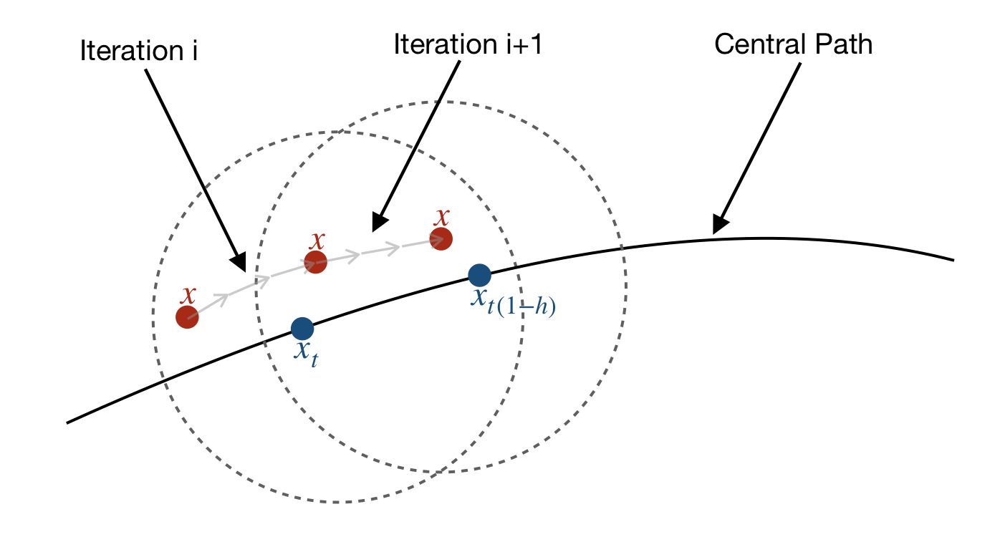

# Interior Point Methods for Solving Linear Programs

* These notes are based on my semester research project in the [Theoretical Computer Science Lab](https://theory.epfl.ch/) at EPFL, where I was supervised by Prof. Kapralov and Kshiteej Sheth.
* Having an idea of what [Linear Programs](https://en.wikipedia.org/wiki/Linear_programming) are and [Convex Optimization](https://en.wikipedia.org/wiki/Convex_optimization) is recommended before reading.

## 1. Introduction \& Problem Statement

Interior-Point Methods are approximation algorithms that solve linear programs. Seen as a framework, it is until now the fastest known algorithm for solving the famous [maximum-flow problem on graphs](https://en.wikipedia.org/wiki/Maximum_flow_problem), and although it has many numerical stability problems in practice, it's the current best framework for optimizing (with high accuracy) general convex functions in both theory and practice.  

These notes first present the general framework of Interior-Point Methods and how it works, and then the concept of barriers is formalized to present the Lee-Sidford barrier, which is used to achieve runtime improvements. The notes will focus on understanding the theoretical concepts of the method rather than focusing on the details of the runtime. The concepts are in my opinion super interesting and very smart!

Given primal variable $x\in \mathbb{R}^n$, objective $c^\top x$ with $c\in\mathbb{R}^n$ and $m+n$ constraints $Ax\geq b, x\geq 0$ with $A\in \mathbb{R}^{m\times n}$ and $b\in\mathbb{R}^m$, our goal is to solve
$$
    (P): \quad\quad \min_{x} \quad c^\top x \quad \text{subject to} \quad Ax \geq b, x \geq 0
$$
approximately up to $\epsilon$-error. 
This is our contrained optimization problem, and the constraints define a convex subset of $\mathbb{R}^n$ which we call the *polytope*.

## 2. Framework Intuition

Unlike other methods for solving linear programs like the Simplex Method that stay on the border of the polytope, in the Interior-Point method we want to start inside the polytope and away from the border, and slowly move towards the border to always work with a feasible point.  

### 2.1 How We Do It

To stay away from the border we massage our constrained optimization problem into an unconstrained one. We introduce a convex function $\phi$ that we will add in our objective, such that as we get closer to the border, the value of the function explodes. This enables to penalize when we arrive near the border and we don't go out of the polytope. Such a function is called a *barrier*, and one simple example of such a function is the log barrier $\phi(x)= -\sum_{i=1}^{n}{[\log(x_i) + \log(a_i^\top x_i - b_i)]}$, where $a_i$ are the columns of $A$. We can now add to our objective function the term $t \phi$, where $t$ is a scalar. $\phi$ ensures that we stay in the feasible region, and $t$ acts as a regularization term such that when $t$ is small, we are close enough to the original problem that we can get a satisfactory approximation.  
The modified problem statement is now
$$
(P_t): \quad\quad \min_{x} \quad c^\top x +t\phi(x)
$$
and we will look at solving this (form of) problem now. Note that this is a set of problems, because the problem $(P_t)$ changes as $t$ changes. The set of optimum points $x_t$ of $(P_t)$ is called the *central path*. And as said before, intuitively, when $t\rightarrow0$, $x_t\rightarrow \tilde{x}$ where $\tilde{x}$ is the optimum of [$(P)$](#_1-introduction-problem-statement). So the idea of the algorithm is that we will follow the central path going in the direction of $\tilde{x}$ (thus decreasing $t$).  

The algorithm proceeds iteratively as follows:

* Initialization: start at $t=1$, find an initial feasible point $x$ "close enough" to $x_1$.
* At each iteration, move $x$ "close enough" to $x_t$ for current $t$, and then decrease $t$ multiplicatively: $t\leftarrow t(1-h)$, $h>0$
* return $x$ once $\lVert x - \tilde{x} \rVert < \varepsilon$ (achieved $\epsilon$-error)  

How we measure "closeness" will be defined more formally later. Achieving $\epsilon$-error is dependent on how small $t$ is.  

From this general intuition, two main questions arise: 

* How close should $x$ be to $x_t$ at each iteration ? THis will control the per-iteration cost.
* How much can we decrease $t$ at each iteration ? This will control the number of iterations.

### 2.2 Some More Intuition

Before going to the next section, I give more detail to the above two questions. Theorems and lemmas defined later will clarify this part, so if things don't get clearer while reading, you can continue to the next parts.  
There's a region that $x$ has to lie into to be able to move closer to $x_t$. If $x$ is not in this region, it might be impossible (or too costly) to later move it closer to $x_t$. So when changing $t$ to $t(1-h)$, we change the target $x_t$ to $x_{t(1-h)}$ and thus we change the region we're looking at: $x$ might be in the region of $x_t$ but it might not be in the region of $x_{t(1-h)}$. That's why we first move $x$ closer to $x_t$, and because of geometric dependecies between $x_t$ and $x_{t(1-h)}$, now $x$ is also close enough so that it is in the region of $x_{t(1-h)}$. Also, if we decrease $t$ too fast ($h$ too high) then we might pay too much in moving $x$ closer to $x_t$, because the region of $x_{t(1-h)}$ is even farther away.  
These are subtleties that will be handled by lemmas in the more formal sections. But for now here are the two more detailed questions:  

* At each iteration, how close should $x$ be to $x_t$ to lie inside the region of $x_{t(1-h)}$ ? This will control the per-iteratin cost.
* How much can we decrease $t$ at each iteration ? This will control the number of iterations.  

Finally, recall that we always want to be close to $x_t$ because as we decrease $t$, $x_t$ aproaches $\tilde{x}$.  

The above image illustrates the process of following the central path. The dotted circles are the regions of $x_t$ and $x_{t(1-h)}$. The per-iteration cost is represented by the grey arrows.

## 3. General Framework

As mentioned before, we start by softening
$$
(P): \quad\quad \min_{x} \quad c^\top x \quad \text{subject to} \quad x \in \mathcal{K}
$$
where $\mathcal{K}$ is a subset of $\mathbb{R}^n$ into
$$
(P_t): \quad\quad \min_{x} \quad \phi_t(x)
$$
where $\phi_t(x)=c^{\top}x + t\phi(x)$ and $\phi(x)$ is a convex function such that $\phi(x) \rightarrow +\infty$ as $x \rightarrow \partial \mathcal{K}$. We call $\phi$ a barrier function for $\mathcal{K}$.

**Definition 1:** The central path is defined as $\{\: x_t = argmin_x \:\phi_t(x) \; | \; t\in \: ] 0 , 1 ] \:\}$  

##### The framework is as follows:
---
1. Find a feasible $x$ close to $x_1$
2. While $t$ is not small enough
    * Move $x$ closer to $x_t$
    * $t\leftarrow t(1-h)$, $h>0$  
---

The goal of IPMs is to start with a point in the central path, and following it until we get a good approximation of the original problem. We do not present how to get the initial point, but there exists multiple methods for getting an initial point efficiently, one of which can be found in [Reference 2](#references).  
Let's now show that this framework works!

### 3.1 Newton Step and Distance Measure

To move $x$ closer to $x_t$, we are using Newton steps:
$$
x \leftarrow x - [\nabla^2\phi_t(x)]^{-1}\nabla\phi_t(x)
$$
Since Newton's method uses the Hessian and performs better when changes in $x$ doesn’t change too much the hessian, we are motivated to make the assumption that the Hessian is Lipschitz (smoothness property). This is why we introduce the definition of *self-concordance* in the next subsection.  
Note that the norm of $[\nabla^2\phi_t(x)]^{-1}\nabla\phi_t(x)$ is called the *step size*.

To study the performance of a Newton’s iteration, we need to define how we measure the distance of $x$ to $x_t$. Since the smaller the step size, the closer we are to the optimum (because $\nabla\phi_t(x)$ small), we define the distance in terms of the size of the step in the Hessian norm.  

**Definition 2:** Given a positive-definite matrix $A$, define ${\lVert v\rVert}^2_A = v^{\top}Av$. The distance $\delta_t(x)$ of $x$ to $x_t$ is defined as follows
$$
\delta_t(x) = {\lVert \nabla^2\phi_t(x)^{-1}\nabla\phi_t(x) \rVert}_{\nabla^2\phi(x)}
$$

The inverse hessian norm is used to account for the amount of Newton steps needed for $x$ to converge to $x_t$. This makes sense algorithmically because the algorithm is faster if few Newton steps are made.  
Note that $\delta_t(x)$ is also ${\lVert \nabla\phi_t(x) \rVert}_{\nabla^2\phi(x)^{-1}}$ (this can be derived by simple calculation). We will mainly use this form instead of the one given in the definiton, but I really wanted to point out that the definition comes from a motivation to analyze Newton steps.  
Also note that $\nabla^2\phi_t(x)=\nabla^2\phi(x)$.  

### 3.2 Self-Concordance: Enabling Convergence

Since we're using Newton steps, remember the convenient assumption that the Hessian should be Lipschitz. Let's define more formally what is the smoothness property we want.  

**Definition 3:** A convex function $f$ is said to be *self-concordant* if $\forall v\in \mathbb{R}^n$, $\forall x \in \text{dom}f$, we have
$$
\text{D}^3f(x)[v,v,v] \leq 2(\text{D}^2f(x)[v,v])^{\frac{3}{2}} = 2{\lVert v \rVert}_{\nabla^2f(x)}^3
$$
D$^kf(x)[v_1,...,v_k]$ is the directional $k^{th}$ derivative of $f$ in directions $v_1,...,v_k$.  

Integrating the local inequality that we have from the definition, we get the following inequality, which says that locally the Hessian of a self-concordant function $f$ doesn't change too fast:  

**Lemma 1:** *Let $f$ be a self-concordant function. Then $\forall x \in \text{dom}f$, and $\forall y\in\text{dom}f$ s.t. $d = {\lVert y-x \rVert}_{\nabla^2f(x)} < 1$,*
$$
(1-d)^2\nabla^2f(x) \preceq \nabla^2f(y) \preceq \frac{1}{(1-d)^2}\nabla^2f(x)
$$
*Proof.* [See Appendix](#proof-lemma-1) (Self-concordance is necessary to prove this lemma)  

When we change $x$, we want the new distance from $x_t$ to be smaller in order to make progress. This is what self-concordance enables. It says that locally, hessian doesn't change too much, so it gives insurance that our Newton step won't diverge or make jumps and stop progressing.  
The following lemma uses this, and says that the self-concordance condition on $\phi$ guarantees convergence when we try to move $x$ closer to $x_t$, provided that $x$ was already close enough. This lemma is one of the main tools that enables the algorithm to proceed iteratively and converge towards the optimum.  

**Lemma 2:** *Let $\phi$ be a self-concordant barrier function. Suppose that $r = \delta_t(x) < 1$. Then, after one Newton step of the form $x' = x - [\nabla^2\phi_t(x)]^{-1}\nabla\phi_t(x)$, we have*
$$
\delta_t(x') \leq \left(\frac{r}{1-r}\right)^2
$$ 
*And moving $x$ using the Newton method results in moving closer to $x_t$.*  

*Proof.* [See Appendix](#proof-lemma-2) (Lemma 1. is necessary to prove this lemma)  

### 3.3 Following the Central Path

Now, changing $t$ must be done carefully, because we want $h$ to be as big as possible (to minimize the number of iterations), while still maintaining our invariant $\delta_t(x) < 1$ of Lemma 2. The following lemma gives an upper-bound on the amount that $\delta_t(x)$ can change as we change $t$, and suggests a maximum amount by which $t$ can change up to the point that our premise of Lemma 2. still holds in the next iteration.  

**Lemma 3:** *Let $\phi$ be a self-concordant barrier function. $t$ is updated following $t \leftarrow t(1-h)$. Then we have that*
$$
{\lVert \nabla\phi_{t(1-h)}(x) \rVert}_{\nabla^2\phi(x)^{-1}} \leq {\lVert \nabla\phi_{t}(x) \rVert}_{\nabla^2\phi(x)^{-1}} + h{\lVert \nabla\phi(x) \rVert}_{\nabla^2\phi(x)^{-1}}
$$

*Proof.* [See Appendix](#proof-lemma-3)  

We can now know how big $h$ can be. For this, let's make our framework more quantitative:  

---
1. Find a feasible $x$ such that  $\delta_1(x) \leq \frac 1 3$
2. While $t$ is not small enough:
    * $x \leftarrow x - [\nabla^2\phi_t(x)]^{-1}\nabla\phi_t(x) \quad$ (this decreases $\delta_t(x)$ to $\frac 1 4$)
    * $t \leftarrow t(1-h)$
---

Assume that $\delta_t(x) \leq \frac{1}{3}$. Then, according to Lemma 2., after a single Newton step, $\delta_t(x) \leq \frac{1}{4}$. To maintain $\delta_{t(1-h)} \leq \frac{1}{3}$ for the next iteration, we want
$$
{\lVert \nabla\phi_{t}(x) \rVert}_{\nabla^2\phi(x)^{-1}} + h{\lVert \nabla\phi(x) \rVert}_{\nabla^2\phi(x)^{-1}} \leq \frac{1}{4} + h \max_{x} {\lVert \nabla\phi(x) \rVert}_{\nabla^2\phi(x)^{-1}} \leq \frac{1}{3}
$$
So we need $h \leq \frac{1}{12 \max_{x} {\lVert \nabla\phi(x) \rVert}_{\nabla^2\phi(x)^{-1}}}$. Taking $h$ to be equal to this value maximizes the change of $t$.  
Notice that the amount by which we change $t$ depends on $\max_{x} {\lVert \nabla\phi(x) \rVert}_{\nabla^2\phi(x)^{-1}}$. The lower this value, the fewer number of iterations we will have to do. We can now derive the second property of self-concordance, and we can now fully define what is *$\nu$-self-concordance*.  

**Definition 4:** Let $\mathcal{K}$ be a convex subset of $\mathbb{R}^n$. We say that $\phi$ is a $\nu$-self-concordant barrier on $\mathcal{K}$ if 
* $\text{D}^3\phi(x)[v,v,v] \leq 2(\text{D}^2\phi(x)[v,v])^{\frac{3}{2}}$ for all $x\in \mathcal{K}$ and $v\in\mathbb{R}^n \quad$ (Definition 3.)  

* ${\lVert \nabla\phi(x) \rVert}^2_{\nabla^2\phi(x)^{-1}} \leq \nu$ for all $x\in \mathcal{K}$  

### 3.4 Termination Condition

Finally, it remains to determine how small $t$ needs to be to achieve $\epsilon$-error. One can upper bound the error by using the duality gap of the problem.  

**Lemma 4:** *Let $\phi$ be a $\nu$-self-concordant barrier on $\mathcal{K}$, and let $\tilde{x}$ be the optimum of [$(P)$](#_3-general-framework). We have that*
$$
c^{\top}x_t - c^{\top}\tilde{x} \;\leq\; t\nu
$$
*Proof.* [See Appendix](#proof-lemma-4)  

Our $x$ is a constant number of iterations close to $x_t$, so to have $c^{\top}x - c^{\top}\tilde{x} \;\leq\; t\nu$ there is only needed a constant number more iterations. Hence, to get an $\epsilon$-error we can set $t = \frac{\epsilon}{\nu} + O(1)$. We can now give the final version of our framework.

##### Final IPM framework
---
1. Find a feasible $x$ such that $\delta_1(x) \leq \frac{1}{3}$
2. While $t > \frac{\epsilon}{\nu}$:
    * $x \leftarrow x - [\nabla^2\phi_t(x)]^{-1}\nabla\phi_t(x) \quad$ (by Lemma 2., $\delta_t(x) \leq \frac{1}{4}$)
    * $t \leftarrow t(1-h)$, $\quad h=\frac{1}{12\sqrt{\nu}}$
---

With this framework complete we can now state a main IPM theorem regarding performance.  

### 3.5 Main IPM Theorem

**Theorem 1:** *Let $\mathcal{K}$ be the polytope defined by the constraints of [$(P)$](#_3-general-framework). Given a $\nu$-self-concordant barrier on $\mathcal{K}$, we can solve [$(P)$](#_3-general-framework) up to $\epsilon$-error in $O(\sqrt{\nu}log(\frac{\nu}{\epsilon}))$ iterations.*  

*Proof.* We need to show that we reach $\epsilon$-error in $O(\sqrt{\nu}log(\frac{\nu}{\epsilon}))$ Newton steps and updates of $t$.  
We start at $t=1$, and at each iteration we multiply $t$ by a factor $(1-h)$. Let $k$ be the number of iterations. We want
$$
(1-h)^k \leq \frac{\epsilon}{\nu}
$$
Solving this gives $k = O(\sqrt{\nu}log(\frac{\nu}{\epsilon}))$.

## Discussion

The performance of the IPM framework we've given depends on $\nu$, the self-concordance of the barrier function we choose. This sort of modularizes the research on the subject and enables to improve the performance by concentrating on finding a better (smaller $\nu$) barrier function.  
This is the topic of another note, which concentrates on the Lee-Sidford barrier, the current best barrier function found that is computable. 

## References

1. Y. T. Lee, A. Sidford - [Solving Linear Programs with sqrt(rank) linear system solves](https://arxiv.org/abs/1910.08033)
2. Lecture notes from the famous Yin Tat Lee: [CSE 599: Interplay between Convex Optimization and Geometry](https://yintat.com/teaching/cse599-winter18/)

## Appendix

### Proof Lemma 1.

Let $\alpha(\lambda) = u^{\top}\nabla^2f(x_{\lambda})^{\top}u$ with $x_{\lambda} = x + \lambda(y-x)$. Then we have that $\alpha'(\lambda) = \text{D}f(x_\lambda)[y-x, u, u]$. By self-concordance we have
$$
\lvert \alpha'(\lambda) \rvert \leq 2{\lVert y-x \rVert}_{\nabla^2 f(x_{\lambda})}{\lVert u \rVert}_{\nabla^2 f(x_{\lambda})}^2
$$
For $u = y-x$, we have $\lvert \alpha'(\lambda) \rvert \leq 2\alpha(\lambda)^{\frac{3}{2}}$. Hence we have $\frac{d}{d\lambda}\frac{1}{\sqrt{\alpha(\lambda)}} \geq -1$. Integrating both on $\lambda$ we have
$$
\frac{1}{\sqrt{\alpha(\lambda)}} \geq \frac{1}{\sqrt{\alpha(0)}} - \lambda = \frac{1}{\sqrt{{\lVert y-x \rVert}_{\nabla^2 f(x)}}} - \lambda
$$
Rearranging it gives
$$\alpha(\lambda) \leq \frac{1}{(\frac{1}{\sqrt{{\lVert y-x \rVert}_{\nabla^2 f(x)}}}-\lambda)^2} = \frac{{\lVert y-x \rVert}_{\nabla^2 f(x)}^2}{(1-\lambda {\lVert y-x \rVert}_{\nabla^2 f(x)})^2}
$$
For general $u$, we can obtain
$$\lvert \alpha'(\lambda) \rvert \leq 2\frac{{\lVert y-x \rVert}_{\nabla^2 f(x)}}{1-\lambda {\lVert y-x \rVert}_{\nabla^2 f(x)}}\alpha(\lambda)
$$
Rearranging gives
$$
\bigg| {\frac{d}{d\lambda} \text{ln}(\alpha(\lambda))} \bigg| \leq 2\frac{{\lVert y-x \rVert}_{\nabla^2 f(x)}}{1-\lambda {\lVert y-x \rVert}_{\nabla^2 f(x)}} = -2\frac{d}{d\lambda} \text{ln}(1-\lambda {\lVert y-x \rVert}_{\nabla^2 f(x)})
$$
Integrating from $\lambda = 0$ to $1$ gives the result.

### Proof Lemma 2.

Lemma 1. shows that 
$$
\nabla^2f(x') \succeq (1-r)^2 \nabla^2f(x)
$$
and hence
$$
{\lVert \nabla f(x') \rVert}_{\nabla^2f(x')^{-1}} \leq \frac{{\lVert \nabla f(x') \rVert}_{\nabla^2f(x)^{-1}}}{1-r} \tag{*}
$$
To bound $\nabla f(x')$, we calculate that
$$\begin{alignat*}{3}
    \nabla f(x') &= \nabla f(x) + \int_0^1{\nabla^2 f(x+t(x'-x))(x'-x)}dt \nonumber\\
    &= \nabla f(x) - \int_0^1{\nabla^2 f(x+t(x'-x))(\nabla^2 f(x))^{-1}\nabla f(x)}dt \\
    &= \left( \nabla^2 f(x) - \int_0^1 {\nabla^2 f(x+t(x'-x))}dt \right)(\nabla^2 f(x))^{-1}\nabla f(x) \tag{**}
\end{alignat*}$$
For the first term in the bracket, we use Lemma 1. to get that
$$
(1-r+\frac{1}{3}r^2)\nabla^2 f(x) \preceq \int_0^1 {\nabla^2 f(x+t(x'-x))}dt \preceq \frac{1}{1-r}\nabla^2 f(x)
$$
Therefore we have
$${\bigg\Vert (\nabla^2 f(x))^{-\frac{1}{2}} \left( \nabla^2 f(x) - \int_0^1 {\nabla^2 f(x+t(x'-x))}dt \right) (\nabla^2 f(x))^{-\frac{1}{2}} \bigg\Vert}_{\text{op}} \leq \text{max}(\frac{r}{1-r}, r-\frac{1}{3}r^2) = \frac{r}{1-r}
$$
Putting it into (**) gives
$${\lVert \nabla f(x') \rVert}_{\nabla^2 f(x)^{-1}} \leq \frac{r}{1-r}\bigg\Vert (\nabla^2 f(x))^{-\frac{1}{2}}\nabla f(x) \bigg\Vert = \frac{r^2}{1-r}
$$
Using this inequality with (*) gives the result.

### Proof Lemma 3.

$$
\begin{alignat*}{3}
    \nabla\phi_{t(1-h)}(x) &= c + t(1-h)\nabla\phi(x) \\
    &= \nabla\phi_t(x) - t\nabla\phi(x) + t(1-h)\nabla\phi(x) \\
    &= \nabla\phi_t(x) - th\nabla\phi(x)
\end{alignat*}
$$
Taking the norm, using triangle inequality and using that $0 < t \leq 1$ and $h \geq 0$, we get
$$
\begin{alignat*}{3}
    {\lVert \nabla\phi_{t(1-h)}(x) \rVert}_{\nabla^2\phi(x)^{-1}} &\leq {\lVert \nabla\phi_{t}(x) -th \nabla\phi(x) \rVert}_{\nabla^2\phi(x)^{-1}} \\
    &\leq {\lVert \nabla\phi_{t}(x) \rVert}_{\nabla^2\phi(x)^{-1}} + th{\lVert \nabla\phi(x) \rVert}_{\nabla^2\phi(x)^{-1}} \\
    &\leq {\lVert \nabla\phi_{t}(x) \rVert}_{\nabla^2\phi(x)^{-1}} + h{\lVert \nabla\phi(x) \rVert}_{\nabla^2\phi(x)^{-1}}
\end{alignat*}
$$

### Proof Lemma 4.

We state a first lemma that will help us in the proof.  

**Lemma:** *Let $\phi$ be a $\nu$-self-concordant barrier, and let $\mathcal{K}$ be the polytope defined by the constraints of [$(P)$](#_3-general-framework). Then, for any $x, y\in \mathcal{K}$*
$$
\langle \nabla\phi(x),(y-x) \rangle \leq \nu
$$
*Proof.* Let $\alpha(\lambda) = \langle \nabla\phi(x_{\lambda}),(y-x) \rangle$ where $x_{\lambda} = x + \lambda(y-x)$. Then
$$
\begin{alignat*}{2}
\alpha'(\lambda) &= (y-x)^{\top}\nabla^2\phi(x_{\lambda})(y-x) \\
&= {\lVert y-x \rVert}_{\nabla^2\phi(x_{\lambda})}^2  
\end{alignat*}
$$
We also have that
$$
\begin{alignat*}{3}
\alpha(\lambda) &= \langle \nabla^2\phi(x_{\lambda})^{- \frac 1 2}\nabla\phi(x_{\lambda}),\nabla^2\phi(x_{\lambda})^{\frac 1 2}(y-x) \rangle \\
&\leq {\lVert \nabla\phi(x_{\lambda}) \rVert}_{\nabla^2\phi(x_{\lambda})^{-1}}{\lVert y-x \rVert}_{\nabla^2\phi(x_{\lambda})^{-1}} \quad \text{(by Cauchy-Schwarz inequality)}\\
&\leq \sqrt{\nu}{\lVert y-x \rVert}_{\nabla^2\phi(x_{\lambda})^{-1}} \quad \text{(by $\nu$-self-concordance)}
\end{alignat*}
$$
Combining the two, we get $\alpha(\lambda) \leq \sqrt{\nu\alpha'(\lambda)} \implies \alpha'(\lambda) \geq \frac{1}{\nu}\alpha(\lambda)^2$
* If $\alpha(0) \leq 0$, we are done because $\nu \geq 0$ and our inequality is satisfied.
* If $\alpha(0) > 0$, then $\alpha$ is increasing in $\lambda$, because $\phi$ is convex (and look at the monotonicity of $\nabla\phi(x_\lambda)^{\top}(y-x)$ depending on the sign of $y-x$). Thus $\alpha(1) \geq \alpha(0) > 0$.  
Furthermore, integrating the inequality $\frac{\alpha'(\lambda)}{\alpha(\lambda)^2} \geq \frac{1}{\nu}$, we have that $\frac{1}{\alpha(1)} \leq \frac{1}{\alpha(0)}-\frac{1}{\nu}$. Thus, $\frac{1}{\alpha(0)}-\frac{1}{\nu} \geq 0$ and $\alpha(0) \leq \nu$ which gives the target inequality.  
 

Now we can use this lemma to prove Lemma 4.  
At the optimal of [$(P_t)$](#_3-general-framework) we have $\nabla\phi_t(x_t) = 0 \implies c + t\nabla\phi(x_t) = 0 \implies c = -t\nabla\phi(x_t)$. Therefore we have
$$
c^{\top}x_t - c^{\top}\tilde{x} = c^{\top}(x_t -\tilde{x}) = t\nabla\phi(x_t)^{\top}(\tilde{x} - x_t) \leq t\nu
$$
which completes the proof.