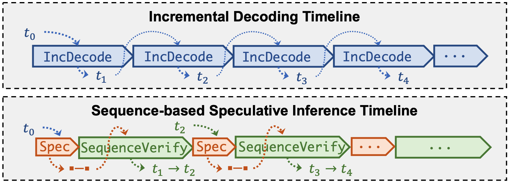
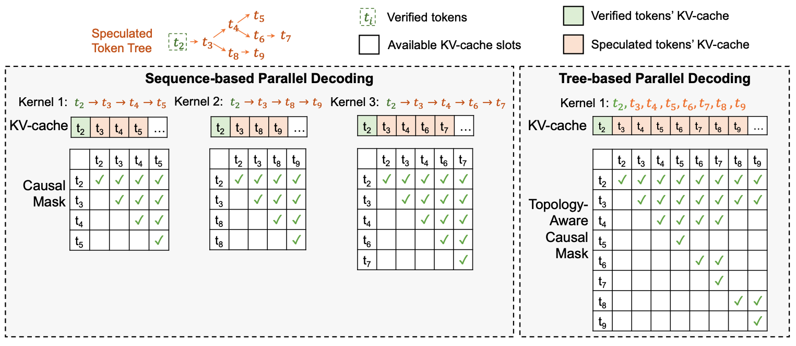
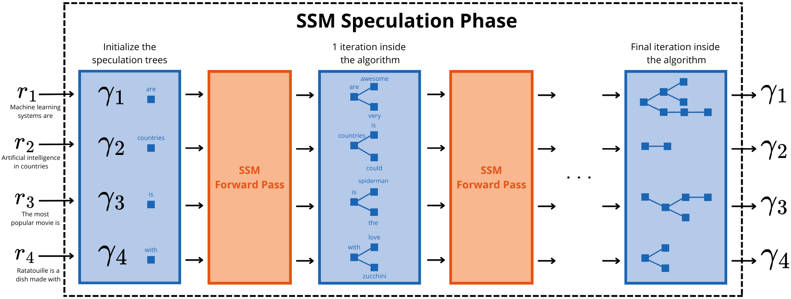
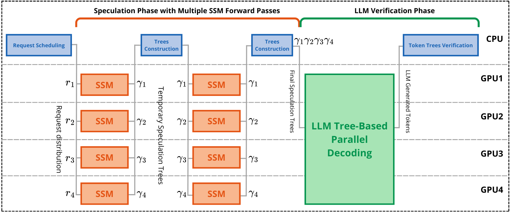
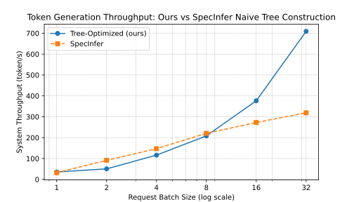
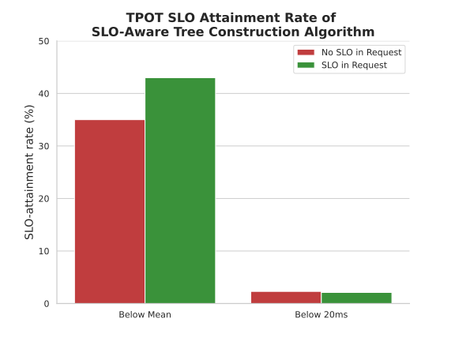
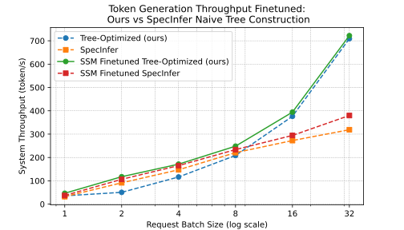
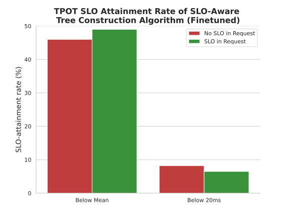

# Improving Large Language Model Inference Throughput by Optimizing SLO-Aware Speculative Decoding

* These notes are based on my Master's Thesis project in the [Catalyst Group](https://catalyst.cs.cmu.edu/) at Carnegie Mellon University, where I was supervised by Prof. Zhihao Jia.
* A small background in Machine Learning and Large Language Models is assumed.

## 1. Introduction

In recent years, advances in hardware capabilities and increased accessibility to compute resources, combined with breakthroughs in Natural Language Processing (NLP) techniques such as Transformers, have paved the way for the emergence of Large Language Models (LLMs). These models, characterized by their massive number of parameters, excel in a wide range of tasks integral to human communication, such as text translation, code generation, and email drafting. As a result, LLMs have captured significant attention in the machine learning community, with models like GPT-3, which powers ChatGPT, achieving unprecedented success by becoming one of the fastest-growing products in history, reaching 100 million users in record time. The rapid development and widespread adoption of LLMs are reshaping various industries, driving the creation of even larger models and expanding their user base.

This rapid growth in LLM usage brings significant scaling challenges: models are becoming larger and more compute-intensive, while the demand for access continues to rise. LLM inference systems must efficiently address these challenges by optimizing resource allocation, scheduling inference requests, and processing them to achieve low latency and high throughput. Innovative approaches are emerging to enhance these systems across all three aspects. One such approach which tackles the third aspect, speculative inference, is the focus of this paper and is discussed in detail in Section [2.2](#22-sequence-based-speculative-decoding).

When designing an LLM inference system, different use cases demand different priorities, such as latency or throughput. For instance, real-time language translation for live conversations is latency-bound, requiring immediate feedback to maintain the natural flow of conversation, which is crucial in contexts like medical consultations or rescue operations. Conversely, batch processing of large-scale document analysis and summarization is throughput-bound. This is particularly valuable for industries like law firms, where extracting key information quickly from numerous documents is essential. High-throughput systems enable simultaneous processing of multiple documents, optimizing the amount of data handled within a given time frame and reducing the cost per document processed.

In this work, we focus on building a throughput-optimized system with minimal latency considerations, as defined below.

To reduce latency and improve resource utilization in LLM inference, recent research has introduced sequence-based speculative inference, where a smaller model generates a sequence of tokens, and the LLM checks their correctness in parallel. This method allows for generating multiple tokens in a single forward pass of the LLM, with the smaller model being relatively inexpensive. Building on this, tree-based speculative inference has been developed, where the smaller model generates a static tree of tokens, further enhancing the correctness and performance of speculation. Our goal is to advance this line of research by providing a theoretically optimal and dynamic tree-construction algorithm aimed at maximizing a throughput objective defined in Problem [(**)](#31-a-throughput-optimized-dynamic-tree-construction-algorithm).

Moreover, current systems employing speculative decoding often inadequately address the performance requirements of incoming requests, specifically per-request service-level objectives (SLOs). The two primary latency SLOs in the literature and LLM serving systems are time-per-output-token (TPOT) and time-to-first-token (TTFT). TPOT measures the average time to generate each token, while TTFT measures the time from request arrival to the generation of the first token. Existing LLM inference systems either attempt to meet SLO requirements on a best-effort basis (i.e., without a defined strategy) or allocate different resources with varying system hyperparameters to manage different SLO requirements. As customer use cases increasingly demand diverse service quality, an SLO-aware LLM serving system becomes essential. For example, some customers may need a responsive UI with stringent TPOT requirements, while others may prioritize information retrieval and accept larger TPOT values. Motivated by these considerations, we propose a TPOT SLO-aware dynamic tree construction algorithm for tree-based speculative decoding, which ensures high inference throughput while adhering to TPOT SLOs.

## 2. A Tour Of Speculative Inference Techniques

### 2.1 From The Base: Incremental Decoding

As mentioned earlier, LLMs are characterized by an exceptionally large number of parameters, which directly impacts the time required to perform a forward pass through the model, thereby increasing inference latency. This challenge is compounded by the auto-regressive nature of LLMs, a fundamental mechanism that further slows down the inference process.

In an auto-regressive model, text generation is sequential: the model predicts the next token in a sequence based on the tokens it has already generated. Specifically, the model generates a sequence of tokens from a given input by predicting each subsequent token conditioned on the previous tokens. To generate the token at position $t+1$, the model must first generate and evaluate all preceding tokens up to position $t$. This inherently sequential process necessitates one forward pass of the model for each token generated, which accumulates significant computational overhead. This method of sequential token generation is commonly referred to as incremental decoding.

The implications of incremental decoding on performance are substantial. Each forward pass through the model must process the entire set of model parameters to generate a single token. Given the vast number of parameters typical in state-of-the-art LLMs -- now numbering in the tens of billions -- this results in considerable computational demands. Moreover, the process is highly memory-intensive. Modern LLMs are so large that they typically exceed the available memory capacity of contemporary GPUs, requiring the model to be partitioned across multiple GPUs or offloaded between GPU and CPU memory. This leads to frequent memory swaps where portions of the model's parameters are swapped in and out of GPU memory to complete the forward pass.

The cost of these memory movements can be substantial. The memory bandwidth, or the rate at which data can be transferred between the CPU, GPU, and memory, becomes a bottleneck in this process. The ratio of memory access time to computation time is very high, meaning that the time spent moving data into and out of memory can dominate the overall latency of the forward pass. This is particularly problematic because modern GPUs are optimized for high-throughput computation, not for managing massive, frequent memory transfers. As a result, the latency of the forward pass in LLM inference is often dictated more by memory access speeds than by the actual computational workload.

### 2.2 Sequence-Based Speculative Decoding

To address the latency issues inherent in incremental decoding, particularly the requirement of performing one forward pass for each token generation, speculative decoding introduces a second, smaller model designed to act as a predictive helper to the main LLM. This smaller model, typically referred to as the Small Speculative Model (SSM), is much more lightweight than the LLM, often being around 20 times smaller. Due to its reduced size, the SSM is less accurate, as predicted by scaling laws that relate model size to performance. Nonetheless, the SSM is usually trained on the same data and in a similar manner as the LLM, ensuring it has a comparable but less refined understanding of the language.

The speculative inference process can be broken down into two main phases: the speculation phase and the verification phase. These phases essentially allow the model to produce multiple tokens in a single inference step.

**Speculation Phase.** In the traditional incremental decoding approach, each token is generated through a single forward pass of the LLM. However, in speculative inference, this process is modified by introducing multiple forward passes of the SSM before involving the LLM. Specifically, given an input sequence of tokens, the SSM is used to generate a sequence of potential next tokens. Let’s denote the number of tokens generated during this phase as $k$, where $k$ represents the number of forward passes made by the SSM. Each forward pass of the SSM is computationally inexpensive due to its smaller size, making this speculation phase much faster than if the LLM were used directly.

The primary goal of this phase is to predict the next few tokens cheaply and quickly. The effectiveness of this approach is based on the assumption that the next few tokens are relatively easy to predict based on the given input sequence. For instance, in many natural language contexts, certain sequences of words are highly predictable after a few initial tokens. The SSM leverages this predictability to generate candidate tokens that are likely to be correct, but with some risk of inaccuracy due to the model's lower precision. The value of $k$ is thus typically set to 4.

**Verification Phase.** After generating $k$ tokens during the speculation phase, the process transitions to the verification phase, where the LLM is used to validate the tokens produced by the SSM. The purpose of this phase is to ensure that the tokens speculated by the SSM are consistent with what the LLM would have generated, thereby maintaining the overall quality and coherence of the output.

In this phase, the original input sequence is augmented by appending the $k$ tokens generated by the SSM to it. The entire augmented sequence, now containing the original input followed by the $k$ speculative tokens, is then fed into the LLM in a single forward pass. Thanks to the architecture of the LLM, particularly the self-attention mechanism used in Transformer models, the LLM can process all tokens in the sequence simultaneously. The self-attention layer enables the model to compute the dependencies between tokens in parallel, which allows the LLM to generate $k$ predictions in parallel -- one for each of the $k$ speculative tokens. For each of the $k$ positions corresponding to the speculative tokens, the LLM predicts the next token based on all previous tokens (both the original input and the speculative tokens up to that point). These predictions are then compared with the corresponding tokens generated by the SSM:

* If a LLM predicted token matches the corresponding SSM speculative token: the token is considered correctly verified and is retained as part of the final output sequence.
* If a LLM predicted token does not match the corresponding SSM speculative token: the token is considered incorrect. In this case, the process discards the incorrect speculative token and any tokens that follow it. The LLM’s generated token replaces the incorrect speculative token, that way the full process generates at least 1 token.

This approach allows for the possibility of generating multiple tokens from a single forward pass of the LLM, rather than just one. The system leverages the computational efficiency of the SSM to speculate on multiple tokens, and it uses the LLM's higher accuracy to ensure the quality of the output. It is common to achieve an average of two tokens generated per forward pass of the LLM.

There are various strategies for verifying tokens depending on whether the tokens are deterministically generated or sampled from a probability distribution. In scenarios where tokens are sampled, it is crucial to ensure that the distribution of the generated sequence remains consistent with what the LLM would have produced if used alone. This requirement maintains the integrity of the language model's output. Throughout this work, token verification is considered to be done deterministically.

### 2.3 SpecInfer: Tree-Based Speculative Decoding

While speculative decoding offers significant improvements in latency by allowing the generation of multiple tokens in a single forward pass, it has a key limitation: if the SSM generates an incorrect token at any position, all subsequent tokens in the sequence are discarded. This limitation is particularly problematic when generating text from high-entropy input sequences, where the likelihood of generating correct tokens in succession decreases. In these cases, speculative decoding may produce only a single valid token per LLM forward pass, potentially negating the latency benefits and even leading to more computational work than traditional incremental decoding.  
A broader limitation of single-sequence speculative decoding lies in the exponential decrease in the probability of successful alignment between the LLM and the SSM as the length of the speculated sequence increases. The longer the sequence, the greater the chance that the SSM will make an error, leading to the discarding of the entire sequence.

To overcome this limitation, tree-based speculative inference extends the idea by generating a tree of speculative tokens instead of a single sequence. In this method, each branch of the tree represents a different potential sequence of predicted tokens, and each node in the tree corresponds to a specific token at that position. By considering multiple candidate tokens at each step, this approach generates a more exhaustive set of speculative sequences, thereby increasing the chances that the LLM's preferred token will align with one of the sequences proposed by the SSM. This is particularly effective because, for many language modeling tasks, the correct token is often among the top $k$ tokens predicted by the SSM, even when $k$ is as small as 3.

**Tree Construction and Linearization.** To implement tree-based speculative inference, we start by constructing the token tree during the speculation phase. At each step, the SSM generates the token distribution, and instead of selecting just one token (for instance the most likely one, as done in sequence-based speculative decoding), we select the top $k$ most likely tokens. This creates a branching structure in the tree. Each path from the root to a leaf in this tree represents a different speculative sequence that could be fed into the LLM for verification.  
However, the LLM expects a linear sequence of tokens as input, not a tree. To resolve this, we linearize the tree in a topological order. In this order, if a node $e$ has a parent $p$ in the tree, then $p$ precedes $e$ in the sequence. This linearization allows the LLM to process the speculative tokens as if they were part of a single sequence, while still maintaining the branching structure necessary for speculative inference.

**Topology-Aware Causal Masking.** The next challenge is ensuring that the LLM's attention mechanism correctly processes this linearized tree. In standard attention mechanisms, each token in the sequence can attend to all previous tokens. However, in tree-based speculative inference, each token should only attend to the previous tokens that are on the same branch. This requires modifying the attention mechanism to incorporate a topology-aware causal mask.  
The topology-aware causal mask is applied to the attention matrix in the self-attention layers of the LLM. For each token in the linearized sequence, the mask restricts attention to only those tokens that are part of the same branch in the original tree structure. This ensures that the attention mechanism correctly captures the dependencies within each branch, while still allowing for parallel processing of the tokens. Importantly, this modification retains the essential properties of the LLM's attention mechanism, ensuring that the model's behavior remains consistent with its original design.  
This process, known as tree-based parallel decoding, allows the LLM to simultaneously verify multiple speculative tokens across different branches of the tree, effectively enabling a broader exploration of possible token sequences while maintaining computational efficiency.

**Verification Phase.** In the verification phase of tree-based speculative inference, the LLM compares its predicted tokens with those generated by the SSM across all branches of the tree. Assuming the use of a greedy strategy, similar to that employed in traditional speculative decoding, the LLM selects the first correct token it identifies in each branch.  
If a branch's speculative token matches the LLM's prediction, that branch is considered verified, and the tokens along that path are appended to the final output sequence. If the LLM's token differs from the speculative token at any point, the branch is pruned, meaning that the tokens along that branch are discarded, and the LLM's prediction is used instead.

This approach not only increases the chances of generating multiple valid tokens in a single forward pass but also reduces the likelihood of discarding a large number of tokens due to a single error by the SSM. As a result, tree-based speculative inference offers a more robust method for improving the throughput and latency of LLM inference, particularly in high-entropy scenarios where single-sequence speculative decoding may perform poorly.

### 2.4 Sequoia: Optimizing Static Speculation Trees

SpecInfer introduced the concept of speculation trees as a way to increase the average number of tokens generated per LLM forward pass. However, the effectiveness of this method depends on how the tree is constructed, which is determined by the tree construction algorithm. In SpecInfer, some straightforward strategies were explored, such as selecting the top $m$ tokens with the highest probabilities as the children for each node in the tree. However, this approach leads to a rapid expansion of the tree, with the size growing exponentially as $m^k$, where $k$ is the depth of the tree. This exponential growth either results in an excessively large tree, which is computationally expensive, or requires limiting the tree depth, which could be too small for speculative decoding to be worth it.  
This raises a critical question: is it possible to design a tree construction algorithm that maximizes the average number of tokens generated per LLM forward pass, while also keeping the latency and computational costs manageable?

The contribution of Sequoia lies in developing a tree construction algorithm that generates an optimal tree structure for speculative decoding. The algorithm is designed with several key assumptions in mind:

* Sample-Specific Optimality: The algorithm’s optimality is evaluated within the context of a specific set of prompts. This means that its effectiveness is closely tied to how representative and exhaustive this sample of prompts is.
* Single Request Processing: The algorithm assumes a batch size of 1, meaning it is designed to handle one request at a time. This simplifies the problem but also limits the generalizability to scenarios where multiple requests might be processed simultaneously.
* Speculation Budget: To manage the latency associated with generating and verifying the tree, a speculation budget is imposed, which limits the size of the tree.

The latency cost of expanding the tree is twofold:

* Tree Depth: The depth of the tree corresponds to the number of forward passes the SSM must perform. A deeper tree requires more computational effort from the SSM, which increases latency.
* Tree Size: A larger tree, once linearized, results in a longer sequence that must be processed by the LLM. Since the computation cost of the attention mechanism in the LLM is quadratic relative to the sequence length, a larger tree significantly increases the latency of the LLM's forward pass.

It is important to note that because the tree construction algorithm is only optimized for a specific sample of prompts, its overall efficiency is dependent on the representativeness of that sample. If the sample is not exhaustive, the algorithm may not perform optimally across a wider range of inputs.

Formally, given the sample of prompts $\mathcal{S}$ and token budget $n$, Sequoia solves

$$
\max_{\gamma\in\Gamma_n}\;{\mathbb{E}_{r\sim\mathcal{S}}[E(r, \gamma)]}
$$

Where $\Gamma_n$ is the set of all possible token trees of size $n$, and $E(r,\gamma)$ is the expected number of tokens from tree $\gamma$ that are verified by the LLM given request $r$. 

Sequoia uses dynamic programming to find each optimal tree for each budget $n$. The results show that, while other tree construction methods see their $E(r,\gamma)$ get upper-bounded as the speculation tree grows, Sequoia's is unbounded and grows logarithmically in the tree size.

The key takeaway of Sequoia is that the optimal tree construction algorithm outputs a tree of bounded size that is optimal on average on a set of prompts. This enables building the tree prior to receiving requests, and using it for every incoming requests: the tree is thus static. But the tree is not tailored to each incoming request, and we can try to do better per request, by constructing trees that are tailored and optimal for each incoming request. This adds some complexity, as we need to compute the trees at every speculation steps: the trees would be dynamic. This dynamic behavior is added in Chapter [3](#3-optimizing-tree-based-speculative-decoding).

Sequoia introduces the theoretical foundations that are used in Chapter [3](#3-optimizing-tree-based-speculative-decoding).  
A speculative token tree is represented as a tree of nodes, where a node $v$ contains a token $t_v$ along with the associated token acceptance probability given the parent tokens $P(t_v \text{ accepted } | t_u  \text{ accepted } \forall u\in  Path(v)) = p_v$. $Path(v)$ is the set of nodes on the path from the root to $v$ included.

The score function of a node $v$ is defined as 
$$
f(v) = \prod_{u\in Path(v)}{p_u}
$$
This score function is called the accumulated probability of v, and it is often written as $v.f$.

With this definition we can derive a closed form solution for $E(\gamma, r)$, the expected number of correctly verified tokens by the LLM from tree $\gamma$ given request $r$:

$$\begin{alignat*}{3}
E(\gamma, r) = \sum_{v\in\gamma}{f(v)} = \sum_{v\in\gamma}{\prod_{u\in Path(v)}{p_u}}\tag{*}
\end{alignat*}$$

Note that the probabilities depend on $r$, and are sampled from the LLM. Refer to the paper for the proof.

## 3. Optimizing Tree-Based Speculative Decoding

In this part, we present our methods for optimizing speculative decoding by providing tree construction algorithms, first without considering TPOT SLO requirements, then with TPOT SLO requirements considered.

Our goal is to maximize average throughput per iteration (i.e. speculation+verification phases) while performing tree-based speculative inference. In the second part, it will be constrained by the TPOT SLO requirements. Throughput is defined as the expected number of correctly verified tokens by the LLM, divided by the latency of the speculation and the verification phases.

We consider a request batch size that can be greater than 1. Note that when the batch size is 1, the (average) latency of generating 1 token is 1/throughput, so optimizing throughput is equivalent to optimizing latency. When the batch size is greater than 1, the latency definition doesn’t change and is still specific to a single request, but the throughput definition is with respect to the full batch. Where some requests with smaller token sequences might be faster to infer individually, in batch inference they have to suffer from the additional time needed to infer other or larger sequences in parallel. Thus, latency usually does not decrease, but throughput increases as we process more requests at once, and optimizing throughput is not the same as optimizing latency.

The following parameters influence the latency of the speculation and verification phases: first, the total amount of tokens to speculate across all requests. This is our token budget, and it influences the latency of the LLM forward-pass, as described in Section [2.3](#23-specinfer-tree-based-speculative-decoding). Then, the maximum tree depth is another parameter which influences the latency, as it is the amount of SSM forward-passes we make.

### 3.1 A Throughput-Optimized, Dynamic Tree Construction Algorithm

**Problem Formulation.** Let $r_1,...,r_B$ be a batch of $B$ requests, on which we are currently performing speculative inference. To mitigate high LLM forward-pass latency cost as explained in Section [2.4](#24-sequoia-optimizing-static-speculation-trees), we have a speculation budget $N$ which we will distribute across the requests. This budget represents the total amount of tokens we are allowed to speculate during the speculation phase. We also have speculation tree size and depth budgets $S$ and $D$, such that the size limit of any tree is $S$ and the maximum depth of any tree is $D$, because $D$ is the amount of SSM forward-passes that is needed. Finally, we also have a width budget $W$, that is tuned in pair with $D$ to either favor wide or deep trees (for example wide trees would be better when the LLM temperature setting is close to 1, and deep trees would be better for temperature close to 0). Here, the width of a tree is the maximum amount of nodes in any depth level. With these budgets, we can estimate the latency $L$ of the full speculative decoding step (speculation+verification steps). $L$ is thus considered constant. Formally, the aim is to find speculation trees $\tilde{\gamma_1},...,\tilde{\gamma_B}$ that are a solution to

$$\begin{alignat*}{3}
\max_{\gamma_1,\ldots,\gamma_B\in\Gamma_{S,D,W}} \quad & \sum_{i\in[B]}{E_{SSM}(r_i, \gamma_i)}\\\tag{**}
\textrm{s.t.} \quad & \sum_{i\in[B]}{|\gamma_i|} = N\\
\end{alignat*}$$

Where $\Gamma_{S,D,W}$ is the set of all trees of maximum size $S$, maximum depth $D$ and maximum width $W$. $E_{SSM}(r_i, \gamma_i)$ is the expected number of verified tokens on request $r_i$ given speculation tree $\gamma_i$. Since $L$ is constant, the objective represents the throughput. The expected value $E_{SSM}(r_i, \gamma_i)$ relies on the following important assumption.

**Key Assumption.** The SSM used for speculation is well-aligned with the LLM used for verification. In this context, alignment means that the output distribution of the model is similar to the other given any prompt.

Using this assumption in our algorithm here means that the expected number of verified tokens by the LLM, noted $E_{SSM}$, is computed using the output distribution of the SSM. This can be seen as follows: $E_{SSM}$ is a random variable with distribution from the LLM, but sampled from the SSM.

**Algorithm Description.** The idea of the algorithm is as follows: we first give the idea while focusing on a single tree of one request. We build the tree so as to maximize $E_{SSM}$. From our assumption, $E_{SSM}$ is computed using the output distribution of the SSM, and its value is given by the expression [(*)](#24-sequoia-optimizing-static-speculation-trees). So the algorithm will keep the tokens from the tree with highest accumulated probability (refer to expression [(*)](#24-sequoia-optimizing-static-speculation-trees)), while being within the tree size, depth and width bounds. To do this, the algorithm proceeds iteratively, with each iteration being an SSM forward-pass, adding one depth layer to the tree. We start with the root of the tree, given by the last token from the sequence. At an iteration, the $k$ children with the highest token acceptance probabilities of each leaf of the last layer are generated using the SSM, and are processed to determine if they should belong to the tree or not. $k$ is chosen to be 4. First, all these children are sorted in descending order of accumulated probability. Since we have a width limit of $W$, we only keep the $W$ first. For each of these children token nodes, we look at its accumulated probability, and add the token if the tree is not of maximum size, or if its accumulated probability is higher than the lowest accumulated probability currently in the tree. If we are in the latter case, we prune the tree, removing the node with such lowest accumulated probability. Otherwise, as soon as there is one child that is not added to the tree (accumulated probability too small), we discard it and the following children. There are at most $D$ iterations, but there can be less, if none of the new children token nodes were added to the tree (which is a stopping criterion).  
Now given this description looking at a single tree, we can describe the algorithm looking at the full batch of requests. We have a speculation budget of $N$ for all the trees. We again iterate over each tree, and proceed as described before for each tree. But we do some additional inter-tree work: if the token budget $N$ is already reached, we compare the current child token's accumulated probability with the lowest accumulated probability associated with a token node across all trees. If it is greater and the token tree of our child has space, we add our child token to its tree, and we prune the (potentially different) tree associated with the lowest accumulated probability token node. We continue proceeding that way until no children are added to any trees, or until one of the size, width, depth bounds are reached for all trees.

One technical note worth mentioning is that, if we want to prune a node which is not in the last layer, we actually don't directly remove it, we only mark it as pruned. This is to avoid having to modify the SSM KV cache layout in memory. In LLM verification and intermediate parts, pruned nodes are considered removed from the tree. This is an implementation detail, but mentioned here as the pseudocode given for the algorithm marks as pruned instead of actually removing. The reader can consider the node as removed when it is pruned.

For token node $t$, $t.f$ represents the accumulated probability of $t$. Note that $f$ is easy to compute, given the acceptance probability of $t$ and the accumulated probability of its parent token node.

**Claim:** Within the assumption given above, the algorithm finds an optimal solution to Problem [(**)](#31-a-throughput-optimized-dynamic-tree-construction-algorithm).

Before giving a proof of this claim, we make the following two observations: first, throughout the algorithm, when a tree is updated, the objective is strictly increasing. Second, when no new nodes are added to a tree, there cannot be further new nodes added to that tree, because any other nodes that can be proposed by the SSM have an accumulated probability lower than the ones already in the tree.

**Proof:** Now, assume that the algorithm has stopped and the solution is suboptimal. This means that there exists a token node $t^*$ that can be added to one of the trees such that the budget constraints are not violated and the objective increases. This means that $t^*$ has depth less or equal to $D$. Since the algorithm sorts candidate children tokens by their accumulated probabilities, the associated tree $\gamma^*$ of $t^*$ has only tokens with accumulated probability greater than the one of $t^*$. So the size of $\gamma^*$ must be less than $S$, and the width at $t^*$'s layer must be less than $W$. Then, since the algorithm stopped, it must be that token budget $N$ has been reached. And since $t^*$ was not added, by the conditions in the algorithm, $t^*$ has accumulated probability lower than all other tokens in all other trees. And at this point, to add $t^*$, a tree different from $\gamma^*$ has to be pruned to increase token budget by 1. Let's say a tree is pruned to remove token $\tilde{t}$. It must be that $\tilde{t}.f > t^*.f$, so from the expression [(*)](#24-sequoia-optimizing-static-speculation-trees), the objective gets decreased by $\tilde{t}.f$ and gets increased by $t^*.f$, so overall it decreases, which is a contradiction. Thus $t^*$ cannot exist.

The algorithm is executed after each SSM forward-pass, and can be fully executed on the CPU with low memory and computation cost. In most common systems, the SSM forward-pass being executed on the GPU and latency being memory-bound, the latency overhead of our algorithm is negligible compared to the SSM forward-pass latency.

### 3.2 An SLO-Aware, Dynamic Token Tree Construction Algorithm

The setup here is that we first generate exhaustive speculation trees for all requests, and then apply a subtree selection algorithm on these trees, to be used for the LLM verification phase. We take subtrees of these speculation trees because it would be too costly during LLM verification to take the full speculation trees. As in the previous algorithm, we have a token budget, which is used for the subtree selection part. In what follows, we assume the speculation trees to be generated, and our algorithm consists in selecting the subtrees of these speculation trees. The way we construct the exhaustive speculation trees is discussed later.

**Problem Formulation.** Given a batch of $B$ requests $r_1, \ldots, r_B$, each with specific TPOT SLOs, we construct their respective exhaustive speculation trees $\gamma_1, \ldots, \gamma_B$ using the SSM ensuring that each tree has at least a size of $N$. To mitigate high LLM forward-pass latency cost, a subtree of each speculation tree is selected for verification, such that the cumulative size of these subtrees equals $N$. $N$ is partitioned among the subtrees, and the subtrees are selected so as to maximize the total expected number of verified tokens during LLM verification. Formally, the aim is to identify subtrees $\tilde{\gamma_1},\ldots,\tilde{\gamma_B}$ that are a solution to the following problem:
$$\begin{alignat*}{3}
\max_{\gamma_1'\subseteq\gamma_1,\ldots,\gamma_B'\subseteq\gamma_B} \quad & \sum_{i\in[B]}{E(\gamma_i')}\\\tag{***}
\textrm{s.t.} \quad & L+\epsilon \leq E(\gamma_i')\cdot SLO(r_i) \quad \forall i\in[B]\\
& \sum_{i\in[B]}{|\gamma_i'|} = N\\
\end{alignat*}$$

Here, $E(\gamma)$ is similar to $E_{SSM}(r,\gamma)$ in Problem [(**)](#31-a-throughput-optimized-dynamic-tree-construction-algorithm), but we simplify the notation because $\gamma$ is a subtree selected from a tree we already know of (the probabilities are already sampled). $L$ is the estimated total latency of the speculation and verification phases, and $\epsilon$ is a system hyperparameter detailed subsequently.

Algorithm 2 finds a solution to Problem [(***)](#32-an-slo-aware-dynamic-token-tree-construction-algorithm), and is explained in what follows.

**Algorithm Description.** Let $\tilde{\gamma}_1, \ldots, \tilde{\gamma}_B$ be the subtrees of $\gamma_1, \ldots, \gamma_B$ associated with requests $r_1, \ldots, r_B$. Starting with a total size budget of $N$, we iteratively allocate one budget unit to one of the subtrees, allowing it to extend by an additional node. Node selection occurs through a greedy algorithm that maximizes the expected number of verified tokens for the subtree's current size budget. The procedure for deciding in each iteration which subtree receives a budget increase is detailed in the following paragraph. Initially, each subtree consists solely of the root of its respective speculation tree, thus having a size of 1. After completing all iterations, the entire size budget $N$ will be utilized, ensuring that $\sum_{i\in[B]}{|\tilde{\gamma_i}|}=N$. With one budget unit allocated per iteration from $N$, a total of $N-B$ iterations are performed.

A node $v$ in a speculation tree $\gamma$ contains several key fields: $v.f$, its accumulated probability as defined in [(*)](#24-sequoia-optimizing-static-speculation-trees), $v.parent$, a pointer to its parent node, $v.depth$, its depth in the tree from the root, and $v.color$, which is set to $Green$ if the node is part of the subtree $\tilde{\gamma}$ of $\gamma$, and $Red$ otherwise. As demonstrated in [(*)](#24-sequoia-optimizing-static-speculation-trees), $E(\gamma) = \sum_{u\in\gamma}{u.f}$. The subtree is built so that for any node $v \neq \gamma.root$, $v.color == Green \implies v.parent.color == Green$.  
Additionally, an ordering of the nodes in $\gamma$ is defined such that for any $u_1,u_2\in\gamma$, if $u_1.f > u_2.f$, or $u_1.f == u_2.f$ but $u_1.depth < u_2.depth$, then $u_1$ precedes $u_2$ in the ordering. $\gamma.root$ precedes all other nodes. This ordering is represented as a linked-list, where each node $v$ in $\gamma$ has a pointer $v.next$ to the subsequent node in the order. For each $i\in[B]$, let $o_i$ be a pointer to the node in $\gamma_i$ with the highest accumulated probability that is colored \textsc{Red} (i.e. that is not in the subtree $\tilde{\gamma_i}$). 

The decision process for allocating the budget unit to a subtree in each iteration is as follows: for each request $r_i$, let $s_i$ be its importance score, and let $v_i$ be the node pointed by $o_i$. If $E(\tilde{\gamma_i})\cdot SLO(r_i)-L-\epsilon < 0$, then $s_i = -(E(\tilde{\gamma_i})\cdot SLO(r_i)-L-\epsilon) + 1$. Otherwise, $s_i=v_i.f$. Let $k=\arg\max_{i\in[B]}{s_i}$. Then $\tilde{\gamma}_k$ is extended with $v_k$, thereby increasing its size by one.

This translates the following priority scheme: the primary objective is to ensure the SLO conditions $L+\epsilon \leq E(\tilde{\gamma_i})\cdot SLO(r_i)$ are satisfied for all $i$ in $[B]$. When $E(\tilde{\gamma_i})\cdot SLO(r_i)-L-\epsilon < 0$, this condition is prioritized by adding $+1$ to ensure the importance score is above all accumulated probabilities $\{v_j.f \mid j\in[B]\}$. Once this condition is met for all requests, the focus shifts to extending the subtree that provides the highest marginal increase in the expected number of verified tokens, resulting in maximizing the objective function of Problem [(***)](#32-an-slo-aware-dynamic-token-tree-construction-algorithm), while adhering to the size budget.

**Slack Hyperparameter $\epsilon$.** For a given request $r_i$, let $R_i$ be the random variable representing the number of verified tokens, with mean $E(\tilde{\gamma_i})$ and variance $\sigma_i^2$. The hyperparameter $\epsilon$ is used to ensure that the condition $L \leq R_i \cdot SLO(r_i)$ is met frequently enough, and is related to $\{\sigma_j^2 \mid j\in[B]\}$ and the variance of $L$. The purpose of $\epsilon$ is to account for the amplitude of the two, such that the target SLO is achieved a specified percentage of the time, for example 90\%.

The reason why we select subtrees from speculation trees, instead of finding a similar algorithm as in previous section, is that the SLO constraints of our Problem [(***)](#32-an-slo-aware-dynamic-token-tree-construction-algorithm) change the dynamics of token node selection. In previous section, we proceed greedily, and make irreversible choices when pruning. We are also discovering the acceptance probabilities as we build the tree. This works because the constraints are fixed. But with the SLO constraints of [(***)](#32-an-slo-aware-dynamic-token-tree-construction-algorithm), modifying one tree may result in modifying the constraints. In the setting of not knowing the full tree in advance, making irreversible decisions such as pruning might result in suboptimal results. If we make decisions while not knowing all the acceptance probabilities, we might want to revert these decisions later.  
Following this idea, we thus decide to first build exhaustive trees to get to know the full tree in advance, and then make decisions based on it.

Now we describe how we construct the exhaustive speculation trees on which we rely to select the subtrees. To stay within the computation and memory bounds of the LLM serving system built for our previous section, we decide to build the exhaustive trees such that they all come from $\Gamma_{S,D,W}$ as described in Problem [(**)](#31-a-throughput-optimized-dynamic-tree-construction-algorithm), i.e. they all have maximum size $S$, maximum depth $D$, and maximum width $W$ across all depth levels. We make sure that $S$ is greater than our token budget $N$ (actually $N-B$), because it could be that all the token budget is given to a single request. The tree construction is simple: at each depth level, we keep the $W$ tokens (generated from the SSM) with highest accumulated probabilities, to give us the best chance at maximizing the objective in [(***)](#32-an-slo-aware-dynamic-token-tree-construction-algorithm). We continue doing this until the maximum depth $D$ is reached or the maximum size $S$ is reached.

## 4. Evaluation

### 4.1 System Design \& Implementation

This work is based on the SpecInfer system, an LLM serving system. SpecInfer’s request manager receives inference requests and schedules them in a FIFO manner. It uses continuous batching introduced in Orca to process requests in parallel: speculative inference proceeds in iterations, where one iteration is composed of one speculation phase followed by one verification phase. At the end of an iteration, if a request is finished, the results are directly sent back to the client, and a request from the FIFO queue is dequeued and added to the batch for inference. This design allows the processing of new requests without having to wait for the currently scheduled requests to finish.  
Since the SSMs are small and can fit in a single GPU, SpecInfer uses data parallelism to process multiple requests. The SSM generated tokens are then sent back to the request manager on the CPU side to continue the tree construction algorithm.  
To be able to serve large LLMs, SpecInfer uses the hybrid parallelization strategy of Megatron-LM, which uses tensor parallelism for parallelizing the Transformer layers across GPUs within a node, and uses pipeline parallelism for partitioning the Transformer layers across nodes. During verification phase, the LLM performs tree-based parallel decoding and generates tokens based on the speculation trees it received. It then sends back the tokens on the CPU to the request manager, which finally verifies the speculated tokens against the LLM's output tokens.

The overhead introduced by the request manager on the CPU side is negligible compared to the execution times of the SSM forward-passes and the LLM forward-pass. On top of this, the communication overhead between the request manager (CPU) and GPUs is minimal, because only the tokens are communicated, their vector representations stay in GPU memory.

### 4.2 Experimental Setup

Our experiments are based on the Llama model family. Specifically, we use JackFram/llama-160m and Felladrin/Llama-160M-Chat-v1 as SSMs, and meta-llama/Llama-2-7b-hf as LLM. We perform evaluation using the following datasets: databricks/databricks-dolly-15k and anon8231489123/ShareGPT\_Vicuna\_unfiltered. Both are chatbot Q\&A and instruction prompts data. anon8231489123/ShareGPT\_Vicuna\_unfiltered dataset has conversations as datapoints, which are a series of prompts from a human followed by an answer from the chatbot. For each of these conversations, we only keep the first prompt instructed by the human as prompt data, to avoid loosing context when the conversation goes deeper.  
For each experiment, we use 700 examples to measure the throughput of the system along with the SLO-attainment rate. The prompt lengths are between 64 and 128, and the maximum number of tokens generated per request is set to 512. The requests are sent in a single batch to the system, as in an offline setting, that way the request processing rate of the system is attained. This is reasonable as we are not interested in the time-to-first-token (TTFT) SLOs.  
The hardware setup for the evaluation consists in 4 A5000 GPUs with 24GB of memory, which share the 56GB Llama2-7b LLM model.

To estimate the latency $L$ of the SSM speculation phase and the LLM verification phase, we perform a moving average of the $k$ last latencies. Our findings are that the LLM verification phase is very stable in our environment, and its variance is extremely low. The SSM has a higher variance, and our $\epsilon$ parameter from Section [3.2](#32-an-slo-aware-dynamic-token-tree-construction-algorithm) should be tuned due to this. A moving average of the $k$ previous values is thus sufficient here, and $k$ is set to 20.  
A warmup routine is performed before each evaluation. The warmup consists in the inference of 5 prompts. The amount of LLM forward-passes for one of these prompts is at least 100, and the number of SSM forward-passes is at least 700.

Throughout the evaluation, we compare our results to SpecInfer where a static speculation tree structure is used.  
SpecInfer constructs a naive static tree, based on the intuition that, according to evaluations, the first two tokens to be generated are easy to speculate, while the next ones get much more difficult for the SSM. On top of this, the first few tokens are important to correctly speculate, otherwise the speculation is discarded early. According to this, the tree only branches out in depth layer 2 (root token is depth layer 0) in 3 directions. The size, depth and width of the tree are respectively 18, 7 and 3. The tree is represented in the following figure.

### 4.3 Results

#### 4.3.1 Before SSM-LLM Alignment

**Evaluation of our first throughput-optimized dynamic tree construction algorithm.** The following figure compares the token generation throughput of our dynamic tree construction algorithm in Section [3.1](#31-a-throughput-optimized-dynamic-tree-construction-algorithm) with SpecInfer's static tree approach. The tree-construction algorithm has a token budget of 64, size limit of 64, depth limit of 8, and width limit of 16.

This comparison highlights several important aspects of our algorithm:
* Alignment Sensitivity: When the SSM is not well aligned with the LLM, the speculative performance suffers, and the potential of our throughput-optimized dynamic tree construction algorithm is not fully realized. As a result, for small batch sizes, the throughput achieved with our algorithm may be similar to or even lower than that obtained with SpecInfer's static trees.
* Aggressive Speculation in Small Batches: In scenarios with small batch sizes, our algorithm tends to perform aggressive speculation. This is because a large token budget is allocated for a relatively small number of requests, resulting in larger token trees.
* Batch Size Impact: As the batch size increases while the token budget remains fixed, the algorithm generates smaller trees for each request within the larger batch. This reduction in tree size decreases the number of SSM forward passes required and lowers the computation cost of the LLM's forward pass (the attention matrix is smaller). As a result, speculative decoding latency is reduced, but the algorithm becomes more conservative on the amount of speculation.
* Cost of Static Trees in Larger Batches: The SpecInfer plot shows that as the batch size increases, the cost of tree-based speculation rises, leading to diminished throughput gains. This cost escalation occurs because SpecInfer uses static trees that are the same size for all requests in the batch, causing a significant increase in the LLM forward-pass cost when processing larger batches.
* Advantages of Dynamic Tree Construction: The results underscore the benefits of our dynamic tree construction approach, which can adapt to various system parameters and conditions. Unlike static trees, dynamic trees adjust to optimize performance while limiting their impact on latency costs.

**Evaluation of our SLO-aware dynamic tree construction algorithm.**
To evaluate the SLO-aware algorithm described in Section [3.2](#32-an-slo-aware-dynamic-token-tree-construction-algorithm), we focus on the TPOT SLO-attainment rate. This metric represents the percentage of requests that meet their specified SLO requirements, or in a more relaxed version, the percentage of requests for which the average TPOT remains below a certain threshold. To establish realistic TPOT SLO values, we first run the system without enforcing any TPOT SLO requirements on the requests and observe the average TPOT achieved.  
Based on this observed average, we select two different TPOT SLO requirement levels for evaluation: one representing a tight SLO and the other a relaxed SLO. We set the proportion of requests with tight SLOs to 20\%, with the remainder having relaxed SLOs. The relaxed SLO values are chosen to be easily attainable, allowing us to better demonstrate the algorithm's ability to prioritize requests with tighter SLOs.  
The setup is as follows: request batch size is 4, maximum tree size per request is 64, token budget is set to 64, and $\epsilon$ hyperparameter is set to 10.0. An $\epsilon$ larger has minimal effect, while setting it to a lower value makes us susceptible to the SSM latency variance. In this system setup, the mean TPOT obtained is 30.4ms, with variance 23.3. Accordingly, we set the tight SLO value at 20ms and the relaxed SLO value at 50ms.

The Mean TPOT is set to 30.4ms.

The results are somewhat disappointing, particularly in the sub-20ms SLO-attainment rate, which falls short of the expected 20\%. However, there is still improvement on the attainment rate of the mean TPOT SLO, indicating that the algorithm does make efforts to account for SLO requirements.

One factor contributing to these mixed results is again the misalignment between the SSM and the LLM. The expected number of tokens decoded by the SSM often does not match the actual number of tokens verified by the LLM. This misalignment can lead to situations where some requests generate more tokens than prioritized requests, although their speculative trees were much smaller. This variability introduces noise into the algorithm's ability to prioritize requests based on their SLO requirements.  
Additionally, the poor results can also be attributed to the difficulty of some prompts. When the entropy of a prompt is high, it becomes harder to make accurate inferences, leading to poor speculative performance. This affects requests with tight SLOs, which are assigned more budget and thus larger trees, but still verify very few tokens.

#### 4.3.2 The Importance Of SSM-LLM Alignment

As discussed in Section [3.1](#31-a-throughput-optimized-dynamic-tree-construction-algorithm), our algorithms are based on the crucial assumption that the SSM and the LLM are aligned in their output distributions.  
In our experiments, we used a relatively small and computationally inexpensive SSM with 160 million parameters to keep the resource requirements manageable. However, the generative capacity of such a small model is quite limited, especially in complex language tasks. This limitation significantly impacts the effectiveness of our algorithms, as the SSM often becomes misaligned with the LLM. The LLM, with its much greater generative power, can produce outputs that the smaller SSM cannot accurately predict, particularly when working with large speculative trees.

To demonstrate the critical importance of alignment between the SSM and LLM, we conducted a simulation to better illustrate the potential of our algorithms when alignment is improved. In this simulation, we first generated outputs from our LLM using our dataset. These LLM-generated outputs were then used as a training dataset for the SSM. By training the SSM on this data, it learned patterns that increased its ability to speculate more effectively, improving the overall alignment with the LLM. The resulting fine-tuned SSM is flechman/Llama-160m-finetuned-thesis which can be found on Huggingface.

While the assumption of alignment between the SSM and LLM might seem strong, it is actually reasonable given recent advances in model development. For example, companies like Anthropic are now building models of varying sizes and capabilities that maintain consistent output distributions when handling sufficiently simple prompts. This means that for prompts where even smaller models can perform well, their outputs are not drastically different from those of larger models.

A more ideal setting to showcase the full potential of our tree construction algorithm would involve using larger, more capable models that can handle complex tasks like chatbot Q\&A. For instance, pairing a Llama2-7B model as the SSM with a Llama2-70B model as the LLM would likely result in much better alignment, thereby enhancing the speculative performance on such tasks. Unfortunately, these larger models require substantial computational resources, which were not available for this evaluation.

#### 4.3.3 After SSM-LLM Alignment

In this part, we do the same evaluation, but this time using our fine-tuned SSM model flechman/Llama-160m-finetuned-thesis, to better illustrate the importance of alignment and the capabilities of our algorithms.

**Evaluation of our first throughput-optimized dynamic tree construction algorithm.** This time, in the following figure, the improved alignment between the SSM and the LLM results in a slight performance gain over SpecInfer's naive static tree generation. For smaller batch sizes, this better alignment allows for more accurate speculation, leading to improved throughput. As the batch size increases, the results become similar to the non-finetuned ones, because the tree sizes get smaller.

**Evaluation of our SLO-aware dynamic tree construction algorithm.** The following figure shows results of our evaluation of the SLO-attainment rate when using the finetuned SSM. Despite the finetuning, the results remain somewhat disappointing. Although there is an observable improvement in both the mean TPOT SLO-attainment rate and the sub-20ms SLO-attainment rate, the overall performance still falls short of expectations. The advantages of our SLO-aware algorithm are not fully highlighted in these results.

The Mean TPOT is set to 27.8ms.

## 5. Conclusion

This work aimed to enhance the efficiency of Large Language Model (LLM) inference systems by developing advanced tree-based speculative decoding algorithms. Key contributions include a theoretically optimal, throughput-optimized dynamic tree construction algorithm and a Service-Level-Objective (SLO)-aware dynamic tree construction algorithm. Both algorithms offer a dynamic approach to building speculation trees, tailored to the characteristics of each individual request, in contrast to previous methods that rely on static trees.

Evaluation results demonstrate that the throughput-optimized algorithm outperforms prior static tree methods, particularly across various request batch sizes. However, the SLO-aware algorithm did not yield as promising results as anticipated. The limitations of this study, particularly the use of smaller, less capable Small Speculative Models (SSM), may have influenced the overall speculative performance. This is mainly due to the assumption that alignment between the SSM and the LLM is crucial for optimal performance.

Future work should explore the application of these algorithms to larger models with greater computational resources, where we expect more promising outcomes. Additionally, while the SLO-aware algorithm's results were not fully conclusive, this work represents a first attempt to address SLO-awareness within a single system instance. The algorithm currently relies on an initial, exhaustively constructed tree, followed by the selection of a subtree. However, little research has been dedicated to optimizing the construction of this initial tree to better serve as a foundation for subtree selection. Enhancing this aspect is proposed as a direction for future research.

In conclusion, this work advances the field of LLM inference systems by introducing novel speculative decoding methods. These contributions not only improve current inference efficiency but also lay the groundwork for future innovations in LLM serving systems.